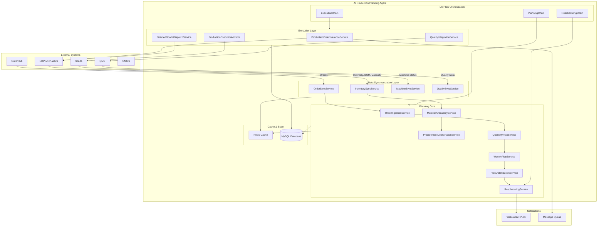
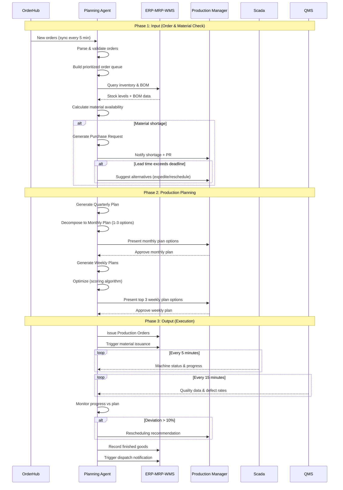
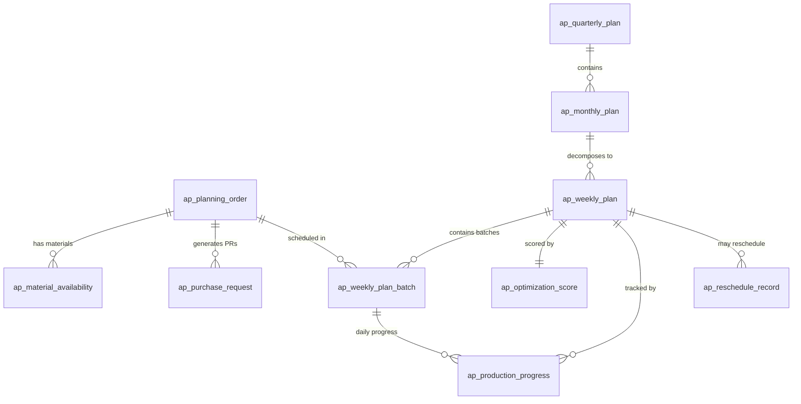
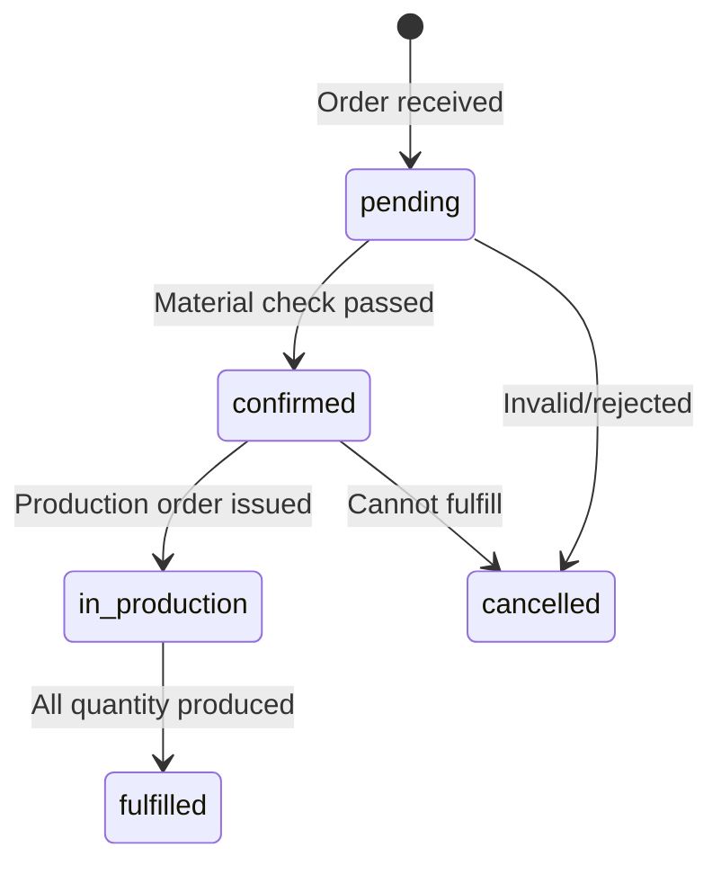
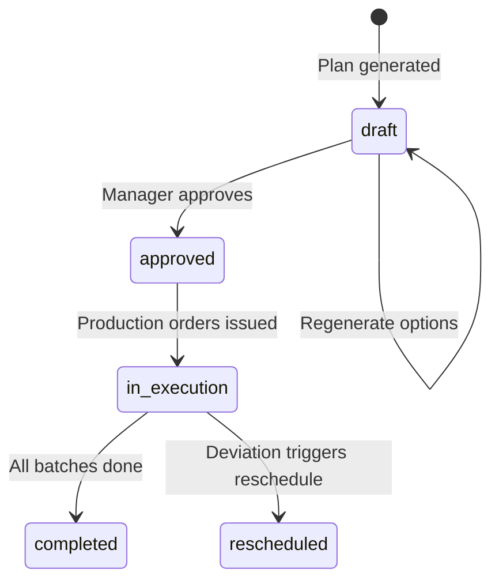

# Design Document: AI Production Planning Agent

## Overview

The AI Production Planning Agent is an intelligent module that automates production planning decisions by analyzing data from multiple enterprise systems (ERP-MRP-WMS, OrderHub, Scada, QMS) and generating optimized production plans. The agent operates across three phases:

1. **Input Phase** — Order ingestion, material availability check, and procurement coordination
2. **Planning Phase** — Quarterly/monthly demand classification, weekly plan generation, and optimization
3. **Output Phase** — Production order issuance, execution monitoring, quality integration, and dispatch tracking

### Key Design Decisions

1. **LiteFlow for AI Orchestration**: Leverage the existing LiteFlow dependency (v2.15.0) for orchestrating the multi-step planning workflow as a chain of components. Each planning phase becomes a LiteFlow node, enabling flexible composition and conditional branching.

2. **Event-Driven Architecture**: Use Spring Events for internal decoupling between phases (order received → inventory check → plan generation). External system integration uses scheduled polling with configurable intervals.

3. **Optimization as a Scoring Engine**: The planning optimization uses a weighted scoring algorithm (not ML-based) with configurable weights. This keeps the system deterministic, auditable, and testable without requiring training data.

4. **Cached Data with Staleness Tracking**: All external system data is cached locally with timestamps. The agent tracks data freshness and degrades gracefully when systems are unavailable, using cached data with explicit staleness warnings.

5. **Immutable Plan Snapshots**: Once a plan is approved, it becomes immutable. Rescheduling creates a new plan version linked to the original, maintaining full audit trail.

6. **Multi-tenant via sys_org_code**: Following the existing JeecgBoot pattern for data isolation between organizations.

## Architecture

### System Architecture



### Planning Workflow Sequence



### LiteFlow Chain Design

The planning workflow is orchestrated using LiteFlow chains:

```xml
<!-- Main Planning Chain -->
<chain name="planningChain">
    THEN(orderIngestion, materialCheck, procurementCheck);
    THEN(quarterlyPlan, monthlyPlan, weeklyPlan);
    THEN(optimizeAndRank);
</chain>

<!-- Rescheduling Chain -->
<chain name="reschedulingChain">
    THEN(deviationDetection, impactAssessment, alternativeGeneration, notifyStakeholders);
</chain>

<!-- Execution Chain -->
<chain name="executionChain">
    THEN(issueProductionOrders, triggerMaterialIssuance);
    WHEN(monitorProgress, monitorQuality);
    THEN(recordFinishedGoods, dispatchNotification);
</chain>
```

## Components and Interfaces

### Backend Components

#### 1. Data Synchronization Layer

**OrderSyncService**
- Polls OrderHub every 5 minutes for new/updated orders
- Transforms external order format to internal `PlanningOrder` entity
- Maintains sync cursor (last sync timestamp)

**InventorySyncService**
- Polls ERP-MRP-WMS every 15 minutes for inventory levels
- Caches BOM data, supplier lead times, and stock levels
- Tracks data freshness with `lastSyncTimestamp`

**MachineSyncService**
- Polls Scada every 5 minutes for machine status
- Caches production line availability and capacity data
- Detects machine breakdowns via status changes

**QualitySyncService**
- Polls QMS every 15 minutes for quality control data
- Caches defect rates and inspection results
- Calculates rolling 30-day and 90-day averages

#### 2. Planning Core Services

**OrderIngestionService**
- Validates incoming orders (completeness, data ranges)
- Consolidates orders by product type
- Maintains prioritized order queue (sorted by deadline, then receipt timestamp)
- Flags incomplete/invalid orders and triggers notifications

**MaterialAvailabilityService**
- Queries cached inventory against BOM requirements
- Calculates material deficit per item
- Reserves materials for confirmed orders
- Validates supplier delivery dates against order deadlines
- Retry logic: 3 attempts with exponential backoff for ERP queries

**ProcurementCoordinationService**
- Generates Purchase Requests with calculated delivery dates
- Maintains supplier lead time database (updated per procurement cycle)
- Generates alternative scenarios when lead time exceeds deadline
- Recalculates production feasibility when materials arrive

**QuarterlyPlanService**
- Classifies demand by product type per month within quarter
- Generates quarterly production demand overview
- Validates against total monthly capacity

**WeeklyPlanService**
- Decomposes monthly plans into weekly schedules
- Assigns products to production lines (capability + availability + changeover time)
- Enforces 90% capacity utilization cap per line per week
- Sequences products to minimize total changeover time
- Verifies material availability for each planned batch

**PlanOptimizationService**
- Calculates optimization score (0-100) using weighted factors:
  - Deadline compliance: ≥40% weight
  - Machine utilization: configurable weight
  - Material availability: configurable weight
  - Order priority: configurable weight
- Ranks valid sequences by score, presents top 3
- Incorporates 90-day historical data (cycle times, defect rates, downtime)

**ReschedulingService**
- Monitors daily production progress vs plan
- Detects deviations >10% from planned quantities
- Recalculates affected plans within 30 minutes of event detection
- Generates ≥2 rescheduling options ranked by optimization score
- Assesses downstream order impact

#### 3. Execution Layer Services

**ProductionOrderIssuanceService**
- Generates Production Orders in ERP within 5 minutes of plan approval
- Includes: product spec, quantity, line, machine, start/end time
- Triggers material issuance to WMS per BOM
- Retry logic: 3 attempts at 60-second intervals
- Updates Weekly Plan status to "In Execution" when all orders acknowledged

**ProductionExecutionMonitor**
- Collects machine status from Scada every ≤5 minutes
- Calculates daily production results (quantities, defect rates, completion %)
- Records finished goods and triggers warehouse receipt
- Generates material return requests for excess materials
- Alerts on consecutive Scada collection failures

**QualityIntegrationService**
- Receives QMS data every ≤15 minutes
- Calculates gross production quantity using historical yield rates
- Alerts when defect rate exceeds 30-day average by >5 percentage points
- Classifies defective products (repairable vs destroyable)
- Triggers additional production scheduling when net output falls below requirements

**FinishedGoodsDispatchService**
- Updates order fulfillment status (In Production / Partially Fulfilled / Fully Fulfilled)
- Notifies sales warehouse for dispatch when fully fulfilled
- Maintains fulfillment dashboard (produced, stocked, dispatched, % complete)
- Refreshes dashboard every ≤15 minutes

#### 4. Controllers (REST API)

**PlanningAgentController** — Base path: `/api/planning-agent`
- `POST /orders/sync` — Trigger manual order sync
- `GET /orders/queue` — Get prioritized order queue
- `GET /orders/{id}/material-check` — Check material availability for order
- `POST /procurement/pr` — Generate Purchase Request
- `GET /procurement/alternatives/{orderId}` — Get alternative scenarios

**PlanController** — Base path: `/api/planning-agent/plans`
- `POST /quarterly` — Generate quarterly plan
- `GET /quarterly/{id}` — Get quarterly plan details
- `POST /monthly` — Generate monthly plan options
- `PUT /monthly/{id}/approve` — Approve monthly plan
- `POST /weekly` — Generate weekly plans from approved monthly
- `PUT /weekly/{id}/approve` — Approve weekly plan
- `GET /weekly/{id}/optimization` — Get optimization details
- `GET /weekly/{id}/reschedule-options` — Get rescheduling options

**ExecutionController** — Base path: `/api/planning-agent/execution`
- `POST /production-orders/{weeklyPlanId}` — Issue production orders
- `GET /progress/{weeklyPlanId}` — Get execution progress
- `GET /daily-results/{date}` — Get daily production results
- `GET /fulfillment/dashboard` — Get fulfillment dashboard

**SyncStatusController** — Base path: `/api/planning-agent/sync`
- `GET /status` — Get sync status for all systems
- `POST /{system}/force-sync` — Force sync with specific system

### Integration Interfaces

#### OrderHub Integration
```java
public interface OrderHubClient {
    List<ExternalOrder> fetchNewOrders(Instant since);
    OrderDetail getOrderDetail(String orderId);
}
```

#### ERP-MRP-WMS Integration
```java
public interface ErpClient {
    InventorySnapshot getInventoryLevels(List<String> materialIds);
    BomStructure getBom(String productId);
    List<SupplierLeadTime> getSupplierLeadTimes(List<String> materialIds);
    ProductionLineCapacity getLineCapacity(String lineId, LocalDate from, LocalDate to);
    void createProductionOrder(ProductionOrderRequest request);
    void triggerMaterialIssuance(MaterialIssuanceRequest request);
    void recordWarehouseReceipt(WarehouseReceiptRequest request);
    void notifyDispatch(DispatchNotification notification);
}
```

#### Scada Integration
```java
public interface ScadaClient {
    List<MachineStatus> getMachineStatuses(List<String> lineIds);
    ProductionProgress getProductionProgress(String lineId, LocalDate date);
}
```

#### QMS Integration
```java
public interface QmsClient {
    QualityReport getQualityData(String productId, String lineId, LocalDate from, LocalDate to);
    DefectClassification classifyDefects(String batchId);
}
```

### Notification Service

```java
public interface PlanningNotificationService {
    void notifyProductionManager(NotificationType type, String message, Map<String, Object> data);
    void notifyOrderOwners(List<String> orderIds, String message);
    void pushDashboardUpdate(DashboardUpdate update);
}
```

Notification types: `ORDER_INCOMPLETE`, `ORDER_INVALID`, `MATERIAL_SHORTAGE`, `DEADLINE_AT_RISK`, `PLAN_GENERATED`, `DEVIATION_DETECTED`, `RESCHEDULE_NEEDED`, `QUALITY_ALERT`, `SYNC_FAILURE`, `SYSTEM_ERROR`

## Data Models

### Database Schema

#### 1. ap_planning_order (Đơn hàng kế hoạch)

```sql
CREATE TABLE IF NOT EXISTS `ap_planning_order` (
    `id`                VARCHAR(36)   NOT NULL COMMENT 'Primary key',
    `external_order_id` VARCHAR(100)  NOT NULL COMMENT 'Order ID from OrderHub',
    `product_type`      VARCHAR(100)  NOT NULL COMMENT 'Product type/code',
    `customer_name`     VARCHAR(200)  NOT NULL COMMENT 'Customer name',
    `quantity`          DECIMAL(15,2) NOT NULL COMMENT 'Order quantity',
    `deadline`          DATE          NOT NULL COMMENT 'Delivery deadline',
    `receipt_timestamp` DATETIME      NOT NULL COMMENT 'Order receipt timestamp',
    `status`            VARCHAR(30)   NOT NULL DEFAULT 'pending'
                        COMMENT 'Status: pending, confirmed, in_production, fulfilled, cancelled',
    `validation_status` VARCHAR(20)   NOT NULL DEFAULT 'valid'
                        COMMENT 'Validation: valid, incomplete, invalid',
    `validation_errors` JSON          NULL     COMMENT 'Validation error details',
    `priority_rank`     INT           NULL     COMMENT 'Position in priority queue',
    `fulfillment_qty`   DECIMAL(15,2) NOT NULL DEFAULT 0 COMMENT 'Quantity fulfilled so far',
    `fulfillment_status` VARCHAR(30)  NULL     COMMENT 'in_production, partially_fulfilled, fully_fulfilled',
    `create_by`         VARCHAR(50)   NULL,
    `create_time`       DATETIME      NULL,
    `update_by`         VARCHAR(50)   NULL,
    `update_time`       DATETIME      NULL,
    `sys_org_code`      VARCHAR(64)   NULL,
    PRIMARY KEY (`id`),
    UNIQUE KEY `uk_external_order` (`external_order_id`),
    KEY `idx_order_deadline` (`deadline`),
    KEY `idx_order_status` (`status`),
    KEY `idx_order_product` (`product_type`)
) ENGINE=InnoDB DEFAULT CHARSET=utf8mb4 COMMENT='Planning Agent - Order Queue';
```

#### 2. ap_material_availability (Tình trạng nguyên vật liệu)

```sql
CREATE TABLE IF NOT EXISTS `ap_material_availability` (
    `id`                VARCHAR(36)   NOT NULL COMMENT 'Primary key',
    `order_id`          VARCHAR(36)   NOT NULL COMMENT 'FK → ap_planning_order',
    `material_id`       VARCHAR(100)  NOT NULL COMMENT 'Material ID from ERP',
    `material_name`     VARCHAR(200)  NULL     COMMENT 'Material name',
    `required_qty`      DECIMAL(15,3) NOT NULL COMMENT 'Required quantity per BOM',
    `available_qty`     DECIMAL(15,3) NOT NULL COMMENT 'Available in inventory',
    `deficit_qty`       DECIMAL(15,3) NOT NULL DEFAULT 0 COMMENT 'Shortage amount',
    `reserved`          TINYINT(1)    NOT NULL DEFAULT 0 COMMENT '1=reserved for this order',
    `supplier_lead_days` INT          NULL     COMMENT 'Supplier lead time in days',
    `expected_arrival`  DATE          NULL     COMMENT 'Expected material arrival date',
    `status`            VARCHAR(20)   NOT NULL DEFAULT 'checking'
                        COMMENT 'checking, available, shortage, pr_generated, received',
    `check_time`        DATETIME      NULL     COMMENT 'Last check timestamp',
    `sys_org_code`      VARCHAR(64)   NULL,
    PRIMARY KEY (`id`),
    KEY `idx_ma_order` (`order_id`),
    KEY `idx_ma_material` (`material_id`)
) ENGINE=InnoDB DEFAULT CHARSET=utf8mb4 COMMENT='Planning Agent - Material Availability';
```

#### 3. ap_purchase_request (Yêu cầu mua hàng)

```sql
CREATE TABLE IF NOT EXISTS `ap_purchase_request` (
    `id`                VARCHAR(36)   NOT NULL COMMENT 'Primary key',
    `pr_code`           VARCHAR(50)   NOT NULL COMMENT 'PR code (PRyyyyMMddNNN)',
    `order_id`          VARCHAR(36)   NOT NULL COMMENT 'FK → ap_planning_order',
    `material_id`       VARCHAR(100)  NOT NULL COMMENT 'Material ID',
    `material_name`     VARCHAR(200)  NULL     COMMENT 'Material name',
    `deficit_qty`       DECIMAL(15,3) NOT NULL COMMENT 'Quantity to procure',
    `required_date`     DATE          NOT NULL COMMENT 'Required delivery date',
    `supplier_lead_days` INT          NOT NULL COMMENT 'Supplier lead time used',
    `status`            VARCHAR(20)   NOT NULL DEFAULT 'generated'
                        COMMENT 'generated, submitted, confirmed, received',
    `actual_delivery`   DATE          NULL     COMMENT 'Actual delivery date',
    `alternatives`      JSON          NULL     COMMENT 'Alternative scenarios JSON',
    `create_by`         VARCHAR(50)   NULL,
    `create_time`       DATETIME      NULL,
    `update_by`         VARCHAR(50)   NULL,
    `update_time`       DATETIME      NULL,
    `sys_org_code`      VARCHAR(64)   NULL,
    PRIMARY KEY (`id`),
    UNIQUE KEY `uk_pr_code` (`pr_code`),
    KEY `idx_pr_order` (`order_id`),
    KEY `idx_pr_material` (`material_id`)
) ENGINE=InnoDB DEFAULT CHARSET=utf8mb4 COMMENT='Planning Agent - Purchase Requests';
```

#### 4. ap_quarterly_plan (Kế hoạch quý)

```sql
CREATE TABLE IF NOT EXISTS `ap_quarterly_plan` (
    `id`                VARCHAR(36)   NOT NULL COMMENT 'Primary key',
    `plan_code`         VARCHAR(50)   NOT NULL COMMENT 'Plan code (QPyyyyQN)',
    `year`              INT           NOT NULL COMMENT 'Year',
    `quarter`           INT           NOT NULL COMMENT 'Quarter (1-4)',
    `status`            VARCHAR(20)   NOT NULL DEFAULT 'draft'
                        COMMENT 'draft, active, completed',
    `demand_summary`    JSON          NOT NULL COMMENT 'Demand by product type per month',
    `capacity_validated` TINYINT(1)   NOT NULL DEFAULT 0 COMMENT '1=capacity validated',
    `capacity_gaps`     JSON          NULL     COMMENT 'Capacity gap details if any',
    `create_by`         VARCHAR(50)   NULL,
    `create_time`       DATETIME      NULL,
    `update_by`         VARCHAR(50)   NULL,
    `update_time`       DATETIME      NULL,
    `sys_org_code`      VARCHAR(64)   NULL,
    PRIMARY KEY (`id`),
    UNIQUE KEY `uk_qp_period` (`year`, `quarter`, `sys_org_code`),
    KEY `idx_qp_status` (`status`)
) ENGINE=InnoDB DEFAULT CHARSET=utf8mb4 COMMENT='Planning Agent - Quarterly Plans';
```

#### 5. ap_monthly_plan (Kế hoạch tháng)

```sql
CREATE TABLE IF NOT EXISTS `ap_monthly_plan` (
    `id`                VARCHAR(36)   NOT NULL COMMENT 'Primary key',
    `plan_code`         VARCHAR(50)   NOT NULL COMMENT 'Plan code (MPyyyyMMNNN)',
    `quarterly_plan_id` VARCHAR(36)   NOT NULL COMMENT 'FK → ap_quarterly_plan',
    `year`              INT           NOT NULL COMMENT 'Year',
    `month`             INT           NOT NULL COMMENT 'Month (1-12)',
    `option_rank`       INT           NOT NULL COMMENT 'Option ranking (1-3)',
    `plan_details`      JSON          NOT NULL COMMENT 'Qty per product, timeline, lines, dates',
    `total_hours`       DECIMAL(10,2) NULL     COMMENT 'Total planned production hours',
    `capacity_utilization` DECIMAL(5,2) NULL   COMMENT 'Capacity utilization percentage',
    `status`            VARCHAR(20)   NOT NULL DEFAULT 'suggested'
                        COMMENT 'suggested, approved, rejected',
    `approved_by`       VARCHAR(50)   NULL,
    `approved_time`     DATETIME      NULL,
    `create_by`         VARCHAR(50)   NULL,
    `create_time`       DATETIME      NULL,
    `sys_org_code`      VARCHAR(64)   NULL,
    PRIMARY KEY (`id`),
    KEY `idx_mp_quarterly` (`quarterly_plan_id`),
    KEY `idx_mp_period` (`year`, `month`)
) ENGINE=InnoDB DEFAULT CHARSET=utf8mb4 COMMENT='Planning Agent - Monthly Plan Options';
```

#### 6. ap_weekly_plan (Kế hoạch tuần)

```sql
CREATE TABLE IF NOT EXISTS `ap_weekly_plan` (
    `id`                VARCHAR(36)   NOT NULL COMMENT 'Primary key',
    `plan_code`         VARCHAR(50)   NOT NULL COMMENT 'Plan code (WPyyyyWNN-NNN)',
    `monthly_plan_id`   VARCHAR(36)   NOT NULL COMMENT 'FK → ap_monthly_plan',
    `year`              INT           NOT NULL COMMENT 'Year',
    `week_number`       INT           NOT NULL COMMENT 'ISO week number',
    `start_date`        DATE          NOT NULL COMMENT 'Week start date',
    `end_date`          DATE          NOT NULL COMMENT 'Week end date',
    `optimization_score` DECIMAL(5,2) NULL     COMMENT 'Optimization score (0-100)',
    `option_rank`       INT           NOT NULL DEFAULT 1 COMMENT 'Option ranking (1-3)',
    `status`            VARCHAR(20)   NOT NULL DEFAULT 'draft'
                        COMMENT 'draft, approved, in_execution, completed, rescheduled',
    `material_verified` TINYINT(1)    NOT NULL DEFAULT 0 COMMENT '1=all materials verified',
    `approved_by`       VARCHAR(50)   NULL,
    `approved_time`     DATETIME      NULL,
    `issued_time`       DATETIME      NULL     COMMENT 'When production orders were issued',
    `version`           INT           NOT NULL DEFAULT 1 COMMENT 'Plan version (increments on reschedule)',
    `parent_plan_id`    VARCHAR(36)   NULL     COMMENT 'FK → ap_weekly_plan (original before reschedule)',
    `create_by`         VARCHAR(50)   NULL,
    `create_time`       DATETIME      NULL,
    `update_by`         VARCHAR(50)   NULL,
    `update_time`       DATETIME      NULL,
    `sys_org_code`      VARCHAR(64)   NULL,
    PRIMARY KEY (`id`),
    UNIQUE KEY `uk_wp_code` (`plan_code`),
    KEY `idx_wp_monthly` (`monthly_plan_id`),
    KEY `idx_wp_week` (`year`, `week_number`),
    KEY `idx_wp_status` (`status`)
) ENGINE=InnoDB DEFAULT CHARSET=utf8mb4 COMMENT='Planning Agent - Weekly Plans';
```

#### 7. ap_weekly_plan_batch (Chi tiết batch trong kế hoạch tuần)

```sql
CREATE TABLE IF NOT EXISTS `ap_weekly_plan_batch` (
    `id`                VARCHAR(36)   NOT NULL COMMENT 'Primary key',
    `weekly_plan_id`    VARCHAR(36)   NOT NULL COMMENT 'FK → ap_weekly_plan',
    `order_id`          VARCHAR(36)   NOT NULL COMMENT 'FK → ap_planning_order',
    `product_type`      VARCHAR(100)  NOT NULL COMMENT 'Product type',
    `quantity`          DECIMAL(15,2) NOT NULL COMMENT 'Planned quantity',
    `gross_quantity`    DECIMAL(15,2) NULL     COMMENT 'Gross qty (adjusted for yield)',
    `production_line_id` VARCHAR(36)  NOT NULL COMMENT 'Assigned production line',
    `machine_id`        VARCHAR(36)   NULL     COMMENT 'Assigned machine',
    `planned_start`     DATETIME      NOT NULL COMMENT 'Planned start datetime',
    `planned_end`       DATETIME      NOT NULL COMMENT 'Planned end datetime',
    `sequence_order`    INT           NOT NULL COMMENT 'Sequence on the production line',
    `changeover_minutes` INT          NOT NULL DEFAULT 0 COMMENT 'Changeover time before this batch',
    `actual_start`      DATETIME      NULL     COMMENT 'Actual start datetime',
    `actual_end`        DATETIME      NULL     COMMENT 'Actual end datetime',
    `actual_quantity`   DECIMAL(15,2) NULL     COMMENT 'Actual produced quantity',
    `status`            VARCHAR(20)   NOT NULL DEFAULT 'planned'
                        COMMENT 'planned, in_progress, completed, rescheduled, on_hold',
    `material_status`   VARCHAR(20)   NOT NULL DEFAULT 'pending'
                        COMMENT 'pending, verified, shortage',
    `sys_org_code`      VARCHAR(64)   NULL,
    PRIMARY KEY (`id`),
    KEY `idx_wpb_plan` (`weekly_plan_id`),
    KEY `idx_wpb_order` (`order_id`),
    KEY `idx_wpb_line` (`production_line_id`),
    KEY `idx_wpb_sequence` (`weekly_plan_id`, `production_line_id`, `sequence_order`)
) ENGINE=InnoDB DEFAULT CHARSET=utf8mb4 COMMENT='Planning Agent - Weekly Plan Batch Details';
```

#### 8. ap_optimization_score (Chi tiết điểm tối ưu)

```sql
CREATE TABLE IF NOT EXISTS `ap_optimization_score` (
    `id`                VARCHAR(36)   NOT NULL COMMENT 'Primary key',
    `weekly_plan_id`    VARCHAR(36)   NOT NULL COMMENT 'FK → ap_weekly_plan',
    `total_score`       DECIMAL(5,2)  NOT NULL COMMENT 'Total optimization score (0-100)',
    `deadline_score`    DECIMAL(5,2)  NOT NULL COMMENT 'Deadline compliance score',
    `deadline_weight`   DECIMAL(3,2)  NOT NULL COMMENT 'Deadline weight (>=0.40)',
    `utilization_score` DECIMAL(5,2)  NOT NULL COMMENT 'Machine utilization score',
    `utilization_weight` DECIMAL(3,2) NOT NULL COMMENT 'Utilization weight',
    `material_score`    DECIMAL(5,2)  NOT NULL COMMENT 'Material availability score',
    `material_weight`   DECIMAL(3,2)  NOT NULL COMMENT 'Material weight',
    `priority_score`    DECIMAL(5,2)  NOT NULL COMMENT 'Order priority score',
    `priority_weight`   DECIMAL(3,2)  NOT NULL COMMENT 'Priority weight',
    `historical_data_used` TINYINT(1) NOT NULL DEFAULT 1 COMMENT '1=used historical, 0=used estimates',
    `constraint_violations` JSON      NULL     COMMENT 'List of constraint violations if any',
    `create_time`       DATETIME      NULL,
    PRIMARY KEY (`id`),
    KEY `idx_os_plan` (`weekly_plan_id`)
) ENGINE=InnoDB DEFAULT CHARSET=utf8mb4 COMMENT='Planning Agent - Optimization Score Details';
```

#### 9. ap_production_progress (Tiến độ sản xuất)

```sql
CREATE TABLE IF NOT EXISTS `ap_production_progress` (
    `id`                VARCHAR(36)   NOT NULL COMMENT 'Primary key',
    `weekly_plan_id`    VARCHAR(36)   NOT NULL COMMENT 'FK → ap_weekly_plan',
    `batch_id`          VARCHAR(36)   NOT NULL COMMENT 'FK → ap_weekly_plan_batch',
    `production_line_id` VARCHAR(36)  NOT NULL COMMENT 'Production line ID',
    `report_date`       DATE          NOT NULL COMMENT 'Report date',
    `planned_qty`       DECIMAL(15,2) NOT NULL COMMENT 'Planned quantity for the day',
    `actual_qty`        DECIMAL(15,2) NOT NULL COMMENT 'Actual produced quantity',
    `defect_qty`        DECIMAL(15,2) NOT NULL DEFAULT 0 COMMENT 'Defective quantity',
    `defect_rate`       DECIMAL(5,4)  NULL     COMMENT 'Defect rate (0.0000-1.0000)',
    `deviation_pct`     DECIMAL(5,2)  NULL     COMMENT 'Deviation percentage from plan',
    `completion_pct`    DECIMAL(5,2)  NULL     COMMENT 'Completion percentage',
    `machine_status`    VARCHAR(20)   NULL     COMMENT 'Machine status at report time',
    `notes`             TEXT          NULL,
    `create_time`       DATETIME      NULL,
    `sys_org_code`      VARCHAR(64)   NULL,
    PRIMARY KEY (`id`),
    KEY `idx_pp_plan` (`weekly_plan_id`),
    KEY `idx_pp_batch` (`batch_id`),
    KEY `idx_pp_date` (`report_date`),
    UNIQUE KEY `uk_pp_batch_date` (`batch_id`, `report_date`)
) ENGINE=InnoDB DEFAULT CHARSET=utf8mb4 COMMENT='Planning Agent - Daily Production Progress';
```

#### 10. ap_reschedule_record (Lịch sử điều chỉnh kế hoạch)

```sql
CREATE TABLE IF NOT EXISTS `ap_reschedule_record` (
    `id`                VARCHAR(36)   NOT NULL COMMENT 'Primary key',
    `original_plan_id`  VARCHAR(36)   NOT NULL COMMENT 'FK → ap_weekly_plan (original)',
    `new_plan_id`       VARCHAR(36)   NULL     COMMENT 'FK → ap_weekly_plan (new version)',
    `trigger_type`      VARCHAR(30)   NOT NULL COMMENT 'deviation, machine_breakdown, material_delay',
    `trigger_details`   JSON          NOT NULL COMMENT 'Details of what triggered reschedule',
    `affected_orders`   JSON          NULL     COMMENT 'List of affected order IDs and impact',
    `options`           JSON          NOT NULL COMMENT 'Rescheduling options presented',
    `selected_option`   INT           NULL     COMMENT 'Which option was selected (1-based)',
    `status`            VARCHAR(20)   NOT NULL DEFAULT 'pending'
                        COMMENT 'pending, approved, rejected',
    `detection_time`    DATETIME      NOT NULL COMMENT 'When deviation was detected',
    `recommendation_time` DATETIME    NULL     COMMENT 'When recommendation was generated',
    `decision_time`     DATETIME      NULL     COMMENT 'When manager made decision',
    `create_by`         VARCHAR(50)   NULL,
    `create_time`       DATETIME      NULL,
    `sys_org_code`      VARCHAR(64)   NULL,
    PRIMARY KEY (`id`),
    KEY `idx_rr_original` (`original_plan_id`),
    KEY `idx_rr_status` (`status`)
) ENGINE=InnoDB DEFAULT CHARSET=utf8mb4 COMMENT='Planning Agent - Reschedule Records';
```

#### 11. ap_sync_status (Trạng thái đồng bộ)

```sql
CREATE TABLE IF NOT EXISTS `ap_sync_status` (
    `id`                VARCHAR(36)   NOT NULL COMMENT 'Primary key',
    `system_name`       VARCHAR(50)   NOT NULL COMMENT 'System: orderhub, erp, scada, qms',
    `last_sync_time`    DATETIME      NULL     COMMENT 'Last successful sync timestamp',
    `last_attempt_time` DATETIME      NULL     COMMENT 'Last sync attempt timestamp',
    `status`            VARCHAR(20)   NOT NULL DEFAULT 'active'
                        COMMENT 'active, failed, stale',
    `consecutive_failures` INT        NOT NULL DEFAULT 0 COMMENT 'Consecutive failure count',
    `last_error`        TEXT          NULL     COMMENT 'Last error message',
    `data_staleness_minutes` INT      NULL     COMMENT 'Minutes since last successful sync',
    `sys_org_code`      VARCHAR(64)   NULL,
    PRIMARY KEY (`id`),
    UNIQUE KEY `uk_sync_system` (`system_name`, `sys_org_code`)
) ENGINE=InnoDB DEFAULT CHARSET=utf8mb4 COMMENT='Planning Agent - System Sync Status';
```

#### 12. ap_supplier_lead_time (Thời gian giao hàng nhà cung cấp)

```sql
CREATE TABLE IF NOT EXISTS `ap_supplier_lead_time` (
    `id`                VARCHAR(36)   NOT NULL COMMENT 'Primary key',
    `material_id`       VARCHAR(100)  NOT NULL COMMENT 'Material ID',
    `supplier_id`       VARCHAR(100)  NULL     COMMENT 'Supplier ID',
    `lead_time_days`    INT           NOT NULL COMMENT 'Current lead time in days',
    `last_actual_days`  INT           NULL     COMMENT 'Last actual delivery duration',
    `avg_lead_time_days` DECIMAL(5,1) NULL     COMMENT 'Average lead time (historical)',
    `last_updated`      DATETIME      NOT NULL COMMENT 'Last update timestamp',
    `update_source`     VARCHAR(30)   NULL     COMMENT 'erp_sync, procurement_cycle',
    `sys_org_code`      VARCHAR(64)   NULL,
    PRIMARY KEY (`id`),
    UNIQUE KEY `uk_slt_material_supplier` (`material_id`, `supplier_id`, `sys_org_code`),
    KEY `idx_slt_material` (`material_id`)
) ENGINE=InnoDB DEFAULT CHARSET=utf8mb4 COMMENT='Planning Agent - Supplier Lead Times';
```

### Entity Relationship Diagram



### State Machines

#### Order Status Flow


#### Weekly Plan Status Flow


## Correctness Properties

*A property is a characteristic or behavior that should hold true across all valid executions of a system — essentially, a formal statement about what the system should do. Properties serve as the bridge between human-readable specifications and machine-verifiable correctness guarantees.*

### Property 1: Order data extraction preserves all fields

*For any* valid external order from OrderHub containing product type, customer name, quantity, and deadline, the ingestion process SHALL produce a PlanningOrder entity where all four fields match the source values exactly.

**Validates: Requirements 1.1**

### Property 2: Order queue maintains sorting invariant

*For any* set of valid orders in the prioritized queue, the queue SHALL be sorted by deadline in ascending order; and for any two orders with the same deadline, the one with the earlier receipt timestamp SHALL appear first.

**Validates: Requirements 1.2, 1.4**

### Property 3: Invalid orders are excluded from the queue

*For any* order that has at least one missing required field (product type, customer name, quantity, or deadline), OR has quantity ≤ 0, OR has a deadline in the past, the order SHALL be excluded from the prioritized order queue and flagged with the correct validation status and error field indication.

**Validates: Requirements 1.3, 1.5**

### Property 4: Material deficit calculation correctness

*For any* BOM requirement specifying required quantity R and available inventory A for a material, the calculated deficit SHALL equal max(0, R - A), and the material status SHALL be "shortage" if and only if R > A.

**Validates: Requirements 2.3**

### Property 5: Material reservation and deadline validation

*For any* order where all BOM materials have available inventory ≥ required quantity, materials SHALL be reserved; AND the order SHALL be flagged as at-risk if and only if (current_date + supplier_lead_time_days) > order_deadline for any reserved material.

**Validates: Requirements 2.2, 2.5, 2.7**

### Property 6: Purchase Request date calculation

*For any* material shortage with a production start date S and supplier lead time L days, the generated Purchase Request SHALL have required_delivery_date = S - L business days, and SHALL include the correct material type and deficit quantity.

**Validates: Requirements 2.4, 3.1**

### Property 7: Alternative scenarios generation on deadline breach

*For any* procurement scenario where supplier delivery time exceeds the production deadline, the system SHALL generate at least 2 alternative scenarios, each containing an estimated cost impact and a revised delivery date.

**Validates: Requirements 3.2**

### Property 8: Quarterly plan demand aggregation

*For any* set of confirmed orders, the generated Quarterly Plan SHALL correctly aggregate total quantity by product type for each month, such that the sum of monthly quantities per product equals the total ordered quantity for that product within the quarter.

**Validates: Requirements 4.1**

### Property 9: Monthly plan capacity validation

*For any* monthly production plan and set of production line capacities, the plan SHALL be marked as capacity-validated if and only if total planned production hours ≤ total available production hours across all lines; and when demand exceeds capacity, at least 2 alternative options SHALL be generated.

**Validates: Requirements 4.3, 4.4**

### Property 10: Weekly plan preserves monthly totals

*For any* approved monthly plan decomposed into weekly plans, the sum of all batch quantities across all weeks SHALL equal the monthly plan's total quantity per product type.

**Validates: Requirements 5.1**

### Property 11: Production line utilization cap

*For any* generated weekly plan, no single production line SHALL be scheduled for more than 90% of its available production hours in that week.

**Validates: Requirements 5.3**

### Property 12: Changeover time minimization

*For any* production line with multiple batches in a weekly plan, the sequence SHALL be ordered such that the total changeover time is less than or equal to the total changeover time of any random permutation of the same batches (locally optimal).

**Validates: Requirements 5.4**

### Property 13: Material availability verification for batches

*For any* batch in a weekly plan, the batch SHALL be flagged as material-verified if and only if all required BOM materials are either currently in inventory OR scheduled to arrive at least 1 business day before the batch's planned start date.

**Validates: Requirements 5.5**

### Property 14: Optimization score calculation and bounds

*For any* weekly plan, the optimization score SHALL equal the weighted sum of (deadline_score × deadline_weight + utilization_score × utilization_weight + material_score × material_weight + priority_score × priority_weight), SHALL be bounded within [0, 100], all weights SHALL sum to 1.0, and deadline_weight SHALL be ≥ 0.40.

**Validates: Requirements 6.1, 6.4**

### Property 15: Plan ranking by optimization score

*For any* set of valid weekly plan options, the presented options SHALL be the top 3 (or fewer if less than 3 exist) ranked by optimization score in descending order.

**Validates: Requirements 6.2**

### Property 16: Minimum-violation plan selection

*For any* set of weekly plans where no plan satisfies all order deadlines, the selected plan SHALL be the one with the fewest deadline violations; and the response SHALL indicate which orders are delayed and by how many days.

**Validates: Requirements 6.5**

### Property 17: Deviation detection threshold

*For any* production line where the cumulative actual quantity deviates from the cumulative planned quantity by more than 10%, the system SHALL generate a rescheduling recommendation; and SHALL NOT generate one when deviation is ≤ 10%.

**Validates: Requirements 7.2**

### Property 18: Rescheduling options with downstream impact

*For any* rescheduling event, the system SHALL generate at least 2 options ranked by optimization score, and SHALL identify all downstream orders affected by the schedule change.

**Validates: Requirements 7.4, 7.5**

### Property 19: Production order completeness

*For any* batch in an approved weekly plan, the generated Production Order SHALL contain product specification, quantity, assigned production line, assigned machine, start time, and expected completion time; AND the triggered material issuance SHALL match the product's BOM quantities exactly.

**Validates: Requirements 8.2, 8.3**

### Property 20: Plan status transition on full acknowledgment

*For any* weekly plan where all Production Orders have been successfully issued and acknowledged by ERP, the plan status SHALL transition to "In Execution".

**Validates: Requirements 8.6**

### Property 21: Daily production metrics calculation

*For any* set of daily production data with actual quantity A, planned quantity P, and defect quantity D, the system SHALL calculate: completion_percentage = (A / P) × 100, defect_rate = D / (A + D), and deviation_percentage = ((A - P) / P) × 100.

**Validates: Requirements 9.2**

### Property 22: Material return threshold

*For any* completed production batch where remaining material quantity exceeds the minimum returnable quantity defined in WMS, the system SHALL generate a material return request; and SHALL NOT generate one when remaining ≤ minimum.

**Validates: Requirements 9.4**

### Property 23: Quality alert threshold

*For any* product where the current defect rate exceeds the rolling 30-day historical average by more than 5 percentage points, the system SHALL generate a quality alert; and SHALL NOT generate one when the excess is ≤ 5 percentage points.

**Validates: Requirements 10.2**

### Property 24: Gross production quantity calculation

*For any* order with net quantity N and historical yield rate Y (where 0 < Y ≤ 1), the gross production quantity SHALL equal N / Y, ensuring planned net output meets order requirements.

**Validates: Requirements 10.3**

### Property 25: Defect impact on net output

*For any* production batch where defective products are classified, the net output SHALL be reduced by the destroyable quantity; and additional production SHALL be triggered if and only if the adjusted net output falls below the order requirement.

**Validates: Requirements 10.4**

### Property 26: Order fulfillment status determination

*For any* customer order with ordered quantity Q and received quantity R: status SHALL be "Fully Fulfilled" when R ≥ Q; "Partially Fulfilled" when 0 < R < Q (with remaining = Q - R); and "In Production" when R = 0 and production orders exist.

**Validates: Requirements 11.1, 11.2, 11.5**

### Property 27: Data staleness blocking

*For any* cached data from an integrated system, the system SHALL prevent new planning decisions if the cache staleness exceeds 60 minutes; and SHALL allow planning decisions when staleness is ≤ 60 minutes (using cached data with a warning when the source system is unavailable).

**Validates: Requirements 12.4**

## Error Handling

### External System Failures

| System | Failure Detection | Retry Strategy | Fallback |
|--------|------------------|----------------|----------|
| OrderHub | No response within 30s or error response | 3 retries, exponential backoff | Use cached orders, warn manager |
| ERP-MRP-WMS | No response within 30s or error response | 3 retries at 60s intervals | Use cached inventory/BOM, flag plans as unvalidated |
| Scada | 2 consecutive collection failures | Immediate retry on next interval | Display last successful data, notify manager |
| QMS | No data for >30 minutes | Retry on next interval | Use historical yield rates, display staleness warning |

### Data Staleness Management

- Each sync service tracks `lastSyncTime` and `consecutiveFailures`
- Staleness is calculated as `now() - lastSyncTime`
- Warning threshold: staleness > sync interval × 2
- Blocking threshold: staleness > 60 minutes (no new planning decisions allowed)
- Recovery: full reconciliation within 10 minutes of sync restoration

### Validation Errors

- **Order validation**: Invalid orders are flagged but never block processing of valid orders in the same batch
- **Plan validation**: Plans with constraint violations are still presented but with violations clearly indicated
- **Capacity data gaps**: Plans generated with cached/estimated data are marked as "unvalidated"

### Notification Escalation

1. **Immediate**: System errors, sync failures, invalid orders
2. **Within 5 minutes**: Material shortages, incomplete orders
3. **Within 30 minutes**: Rescheduling recommendations, deviation alerts
4. **Dashboard refresh**: Every ≤15 minutes for fulfillment progress

### Transaction Management

- Order ingestion: batch transaction per sync cycle (all-or-nothing per cycle)
- Plan generation: single transaction per plan (quarterly/monthly/weekly)
- Production order issuance: individual transaction per order with independent retry
- Material reservation: optimistic locking with version check to prevent double-reservation

### Idempotency

- Order sync uses `external_order_id` as deduplication key
- Production order issuance uses `batch_id + version` to prevent duplicate orders
- Material reservation checks current reservation status before re-reserving

## Testing Strategy

### Property-Based Testing (jqwik)

The project already uses **jqwik 1.9.1** for property-based testing. Each correctness property defined above will be implemented as a jqwik property test with a minimum of 100 iterations.

**Test tag format**: `Feature: ai-production-planning, Property {number}: {property_text}`

**Key areas for PBT**:
- Order queue sorting invariants (Properties 1-3)
- Material deficit and date arithmetic (Properties 4-6)
- Plan decomposition and aggregation (Properties 8, 10)
- Optimization score calculation and bounds (Property 14)
- Threshold-based decisions (Properties 17, 22, 23, 27)
- Status determination logic (Properties 20, 26)

**Generator strategy**:
- `PlanningOrder` generator: random product types, quantities (positive decimals), deadlines (future dates), timestamps
- `BomRequirement` generator: random material IDs with positive required quantities
- `InventoryLevel` generator: random available quantities (including zero for shortage scenarios)
- `ProductionLineCapacity` generator: random available hours, changeover matrices
- `WeeklyPlanBatch` generator: random batches with valid date ranges and quantities

### Unit Tests (JUnit 5 + Mockito)

**Focus areas**:
- Integration client behavior (mocked external systems)
- Retry logic verification
- State machine transitions
- Notification triggering
- Edge cases: empty order lists, single-item BOMs, zero yield rates

### Integration Tests

**Focus areas**:
- End-to-end sync cycle with mocked external endpoints
- LiteFlow chain execution with real service beans
- Database transaction behavior (reservation conflicts, concurrent updates)
- Scheduled task execution timing

### Test Organization

```
src/test/java/com/cy/modules/planning/agent/
├── properties/                    # jqwik property tests
│   ├── OrderQueueProperties.java
│   ├── MaterialCalculationProperties.java
│   ├── PlanDecompositionProperties.java
│   ├── OptimizationScoreProperties.java
│   ├── ThresholdDecisionProperties.java
│   └── FulfillmentStatusProperties.java
├── unit/                          # JUnit unit tests
│   ├── OrderIngestionServiceTest.java
│   ├── MaterialAvailabilityServiceTest.java
│   ├── WeeklyPlanServiceTest.java
│   ├── PlanOptimizationServiceTest.java
│   ├── ReschedulingServiceTest.java
│   └── QualityIntegrationServiceTest.java
└── integration/                   # Integration tests
    ├── SyncServiceIntegrationTest.java
    ├── PlanningChainIntegrationTest.java
    └── ProductionOrderIssuanceTest.java
```

### Test Configuration

```java
// jqwik configuration for property tests
@Property(tries = 100)  // Minimum 100 iterations per property
@Tag("property-test")
@Tag("ai-production-planning")
```

### Coverage Goals

- Property tests: Cover all 27 correctness properties
- Unit tests: Cover error paths, retry logic, edge cases
- Integration tests: Cover sync cycles, LiteFlow chains, database transactions
- Combined target: ≥80% line coverage on planning agent module
