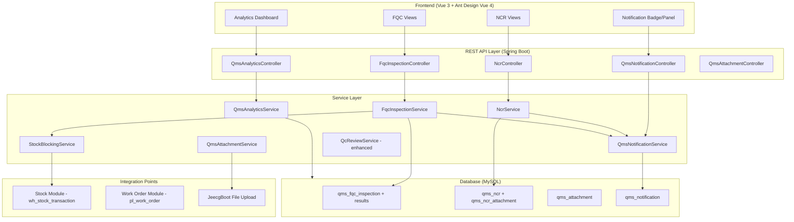
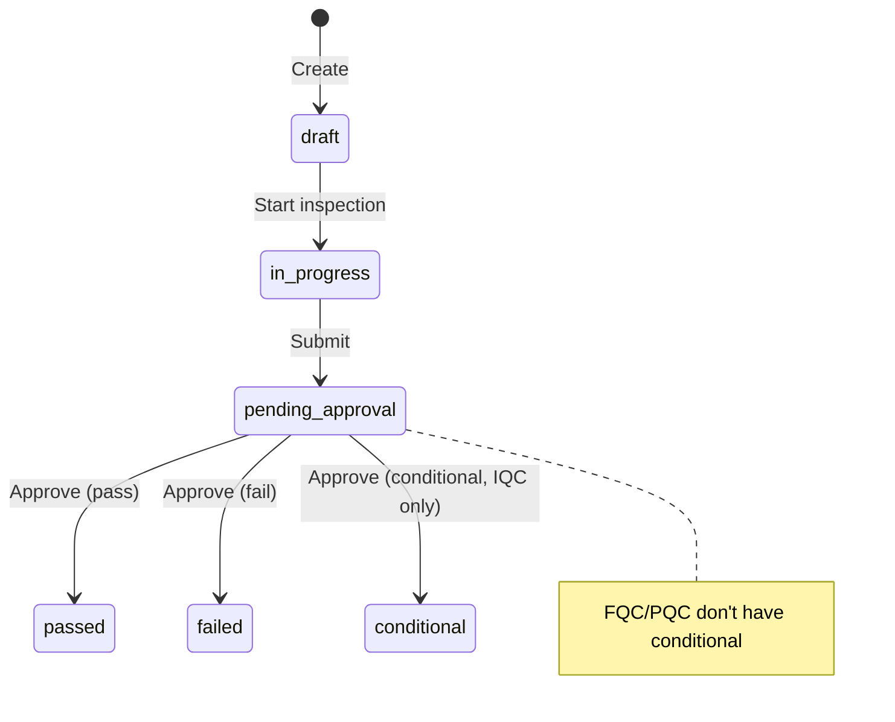
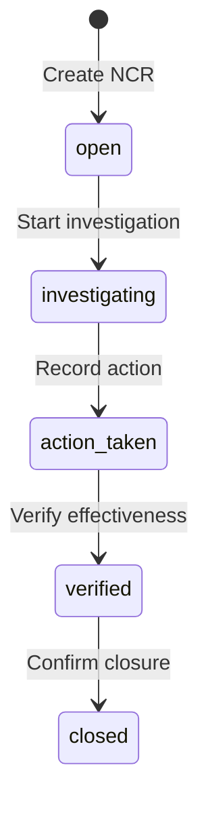

# Design Document: QMS Quality Management

## Overview

This design extends the existing QMS module with new capabilities: FQC (Final Quality Control), NCR (Non-Conformance Report), stock blocking integration, attachment support, notification system, quality analytics dashboard, improved QC Review statistics, and role-based permissions.

The existing module already provides IQC, PQC, QC Stage/Session, QC Review, and Checklist Template functionality. This design focuses exclusively on **new features** to be built, following the established patterns in the codebase:
- Backend: JeecgBoot controller pattern with `JeecgController` base class, `ServiceImpl<Mapper, Entity>`, MyBatis-Plus `QueryWrapper`
- Frontend: Ant Design Vue `BasicTable` + `useTable` + `useModal` pattern
- API: `defHttp` with standardized CRUD endpoints (`/list`, `/add`, `/edit`, `/delete`)
- Code generation: `PREFIXyyyyMMddNNN` sequential format

### Key Design Decisions

1. **FQC follows IQC/PQC pattern** — Same entity structure, service layer, and controller pattern for consistency
2. **NCR is a standalone entity** with polymorphic links to IQC/PQC/FQC via `source_type` + `source_id`
3. **Stock blocking uses event-driven approach** — IQC approval triggers stock state update via service call (not async messaging, keeping it simple for SME scale)
4. **Attachments use JeecgBoot's built-in file upload** — Leverages existing `CommonController` upload endpoint with a linking table
5. **Notifications use database-backed in-app notifications** — No external messaging service; scheduled job for reminders
6. **Analytics computed on-demand** with optional caching for dashboard performance

## Architecture



## Components and Interfaces

### 1. FQC Module (New)

**Controller:** `FqcInspectionController` — `/qms/fqc/*`

| Endpoint | Method | Description |
|----------|--------|-------------|
| `/qms/fqc/list` | GET | Paginated list with filters |
| `/qms/fqc/add` | POST | Create FQC inspection |
| `/qms/fqc/edit` | PUT | Update FQC inspection |
| `/qms/fqc/delete` | DELETE | Delete (draft only) |
| `/qms/fqc/queryById` | GET | Detail with results |
| `/qms/fqc/getResults` | GET | Get criteria results |
| `/qms/fqc/submit/{id}` | PUT | Submit for approval |
| `/qms/fqc/approve/{id}` | PUT | Approve/reject |
| `/qms/fqc/statistics` | GET | FQC statistics |
| `/qms/fqc/checkOutbound/{orderId}` | GET | Check if outbound is allowed |

**Service:** `FqcInspectionService` extends `IService<FqcInspection>`
- `generateInspectionCode()` → `FQCyyyyMMddNNN`
- `saveWithResults(inspection, results)`
- `submitForApproval(id)` → triggers notification
- `approveInspection(id, status, notes, operator)` → if passed, unblocks outbound
- `isOutboundAllowed(orderId)` → checks if linked FQC is passed

**Entity:** `FqcInspection` — mirrors `IqcInspection` structure with `outboundOrderId` and `customerId` instead of `supplierId`/`stockTransactionId`

### 2. NCR Module (New)

**Controller:** `NcrController` — `/qms/ncr/*`

| Endpoint | Method | Description |
|----------|--------|-------------|
| `/qms/ncr/list` | GET | Paginated list with filters |
| `/qms/ncr/add` | POST | Create NCR |
| `/qms/ncr/edit` | PUT | Update NCR |
| `/qms/ncr/delete` | DELETE | Delete (open only) |
| `/qms/ncr/queryById` | GET | Detail with attachments |
| `/qms/ncr/transition/{id}` | PUT | State transition |
| `/qms/ncr/close/{id}` | PUT | Close NCR (requires confirmation) |
| `/qms/ncr/statistics` | GET | NCR statistics |
| `/qms/ncr/bySupplier/{supplierId}` | GET | NCR history for supplier |

**Service:** `NcrService` extends `IService<Ncr>`
- `generateNcrCode()` → `NCRyyyyMMddNNN`
- `createFromInspection(inspectionId, sourceType)` → auto-links supplier if IQC
- `transition(id, targetStatus, notes, operator)` → validates state machine
- `close(id, confirmationNotes, operator)` → requires corrective action confirmation
- `getSupplierHistory(supplierId)` → NCR list for supplier quality tracking

**State Machine:** `open → investigating → action_taken → verified → closed`

### 3. Stock Blocking Integration (New)

**Service:** `StockBlockingService`
- `handleIqcApproval(inspectionId, status)` — called by `IqcInspectionService.approveInspection()`
  - `failed` → set `stock_transaction.qc_status = 'blocked'`
  - `conditional` → set `stock_transaction.qc_status = 'conditional_hold'`
  - `passed` → set `stock_transaction.qc_status = 'available'`
- `isStockAvailable(stockTransactionId)` → checks if stock can be used in WO
- `releaseBlock(stockTransactionId, ncrId)` → releases block after NCR resolution

**Integration:** Modifies existing `IqcInspectionServiceImpl.approveInspection()` to call `StockBlockingService` after status update. Requires adding `qc_status` column to `wh_stock_transaction` table.

### 4. Attachment Module (New)

**Controller:** `QmsAttachmentController` — `/qms/attachment/*`

| Endpoint | Method | Description |
|----------|--------|-------------|
| `/qms/attachment/upload` | POST | Upload file (multipart) |
| `/qms/attachment/list` | GET | List attachments by entity |
| `/qms/attachment/delete` | DELETE | Delete attachment |

**Service:** `QmsAttachmentService`
- `upload(file, entityType, entityId)` → validates format/size, stores via JeecgBoot upload
- `listByEntity(entityType, entityId)` → returns attachments for an entity
- `validateFile(file)` → checks format (JPG/PNG/PDF/DOCX/XLSX) and size (≤10MB)
- `countByEntity(entityType, entityId)` → for max 10 check
- `compressImageIfNeeded(file)` → compress if image > 10MB

**Entity types:** `iqc`, `pqc`, `fqc`, `ncr`

### 5. Notification Module (New)

**Controller:** `QmsNotificationController` — `/qms/notification/*`

| Endpoint | Method | Description |
|----------|--------|-------------|
| `/qms/notification/list` | GET | List notifications for current user |
| `/qms/notification/unreadCount` | GET | Count unread notifications |
| `/qms/notification/markRead/{id}` | PUT | Mark as read |
| `/qms/notification/markAllRead` | PUT | Mark all as read |

**Service:** `QmsNotificationService`
- `sendApprovalRequest(entityType, entityId, targetUserId)` → creates notification
- `sendApprovalResult(entityType, entityId, result, targetUserId)` → notifies creator
- `getUnreadCount(userId)` → count for badge
- `sendReminder()` → scheduled job, finds pending_approval > 24h

**Scheduled Job:** `QmsNotificationScheduler` — runs every hour, checks for overdue approvals

### 6. Analytics Module (New)

**Controller:** `QmsAnalyticsController` — `/qms/analytics/*`

| Endpoint | Method | Description |
|----------|--------|-------------|
| `/qms/analytics/dashboard` | GET | Dashboard summary data |
| `/qms/analytics/trend` | GET | Pass/fail trend by week/month |
| `/qms/analytics/supplier/{id}` | GET | Supplier quality report |
| `/qms/analytics/pareto` | GET | Top 5 failure criteria |
| `/qms/analytics/export` | GET | Export report (PDF/Excel) |

**Service:** `QmsAnalyticsService`
- `getDashboardSummary(filters)` → pass/fail ratios by type, open NCR count
- `getTrend(startDate, endDate, groupBy)` → time-series data
- `getSupplierReport(supplierId)` → IQC pass rate, NCR count, ranking
- `getParetoAnalysis(filters)` → top 5 criteria by failure rate
- `exportReport(format, filters)` → generates PDF/Excel via JeecgBoot export

### 7. Enhanced QC Review Statistics

**Changes to existing `QcReviewServiceImpl`:**
- Fix `syncStats()` to correctly count passed/failed based on `QcSessionValue.result` field (not just session status)
- Add `suggestOverallResult(reviewId)` → returns suggested result based on session outcomes
- Add `overrideResult(reviewId, result, reason, operator)` → allows manager override with reason

### 8. Permission/Authorization

**Approach:** Leverage JeecgBoot's built-in permission system (`@RequiresPermissions` annotation)

**Permission codes:**
| Permission | Role | Description |
|-----------|------|-------------|
| `qms:inspection:add` | Nhân_viên_QC | Create inspections |
| `qms:inspection:edit` | Nhân_viên_QC | Edit draft/in_progress inspections |
| `qms:inspection:approve` | Quản_lý_QC | Approve/reject inspections |
| `qms:ncr:add` | Nhân_viên_QC | Create NCR |
| `qms:ncr:close` | Quản_lý_QC | Close NCR |
| `qms:template:manage` | Admin | Manage templates and stages |
| `qms:analytics:view` | Quản_lý_QC | View analytics dashboard |

**Frontend:** Use `v-auth` directive to conditionally render approve/reject buttons based on user permissions.

**Audit Log:** Use JeecgBoot's `@AutoLog` annotation on all state-changing endpoints (already partially implemented in existing controllers).

## Data Models

### New Tables

#### `qms_fqc_inspection`
```sql
CREATE TABLE IF NOT EXISTS `qms_fqc_inspection` (
    `id`                    VARCHAR(36)    NOT NULL,
    `inspection_code`       VARCHAR(50)    NOT NULL COMMENT 'FQCyyyyMMddNNN',
    `outbound_order_id`     VARCHAR(36)    NULL     COMMENT 'FK → outbound order',
    `product_id`            VARCHAR(36)    NOT NULL COMMENT 'FK → product',
    `customer_id`           VARCHAR(36)    NULL     COMMENT 'FK → customer',
    `template_id`           VARCHAR(36)    NULL     COMMENT 'FK → qms_checklist_template',
    `quantity_inspected`    DECIMAL(10,3)  NOT NULL DEFAULT 0,
    `quantity_passed`       DECIMAL(10,3)  NULL,
    `quantity_failed`       DECIMAL(10,3)  NULL,
    `inspector`             VARCHAR(100)   NULL,
    `inspection_date`       DATE           NULL,
    `status`                VARCHAR(20)    NOT NULL DEFAULT 'draft',
    `notes`                 TEXT           NULL,
    `create_by`             VARCHAR(50)    NULL,
    `create_time`           DATETIME       NULL,
    `update_by`             VARCHAR(50)    NULL,
    `update_time`           DATETIME       NULL,
    `sys_org_code`          VARCHAR(64)    NULL,
    PRIMARY KEY (`id`),
    UNIQUE KEY `uk_fqc_code` (`inspection_code`)
) ENGINE=InnoDB DEFAULT CHARSET=utf8mb4;
```

#### `qms_fqc_inspection_result`
```sql
CREATE TABLE IF NOT EXISTS `qms_fqc_inspection_result` (
    `id`                 VARCHAR(36)   NOT NULL,
    `inspection_id`      VARCHAR(36)   NOT NULL COMMENT 'FK → qms_fqc_inspection',
    `checklist_item_id`  VARCHAR(36)   NULL,
    `criterion_name`     VARCHAR(200)  NOT NULL,
    `standard_value`     VARCHAR(200)  NULL,
    `actual_value`       VARCHAR(500)  NULL,
    `result`             VARCHAR(20)   NULL COMMENT 'passed/failed/na',
    `notes`              TEXT          NULL,
    PRIMARY KEY (`id`),
    KEY `idx_fqc_inspection_id` (`inspection_id`)
) ENGINE=InnoDB DEFAULT CHARSET=utf8mb4;
```

#### `qms_ncr`
```sql
CREATE TABLE IF NOT EXISTS `qms_ncr` (
    `id`                VARCHAR(36)    NOT NULL,
    `ncr_code`          VARCHAR(50)    NOT NULL COMMENT 'NCRyyyyMMddNNN',
    `source_type`       VARCHAR(20)    NOT NULL COMMENT 'iqc/pqc/fqc/other',
    `source_id`         VARCHAR(36)    NULL     COMMENT 'FK → source inspection',
    `product_id`        VARCHAR(36)    NULL     COMMENT 'FK → product',
    `supplier_id`       VARCHAR(36)    NULL     COMMENT 'FK → supplier (auto from IQC)',
    `description`       TEXT           NOT NULL COMMENT 'Mô tả lỗi',
    `severity`          VARCHAR(20)    NOT NULL COMMENT 'critical/major/minor',
    `quantity_defective` DECIMAL(10,3) NULL,
    `proposed_action`   VARCHAR(50)    NULL     COMMENT 'return/repair/scrap/accept_conditional',
    `corrective_action` TEXT           NULL     COMMENT 'Hành động khắc phục thực tế',
    `status`            VARCHAR(30)    NOT NULL DEFAULT 'open',
    `assigned_to`       VARCHAR(100)   NULL,
    `closed_by`         VARCHAR(100)   NULL,
    `closed_date`       DATETIME       NULL,
    `notes`             TEXT           NULL,
    `create_by`         VARCHAR(50)    NULL,
    `create_time`       DATETIME       NULL,
    `update_by`         VARCHAR(50)    NULL,
    `update_time`       DATETIME       NULL,
    `sys_org_code`      VARCHAR(64)    NULL,
    PRIMARY KEY (`id`),
    UNIQUE KEY `uk_ncr_code` (`ncr_code`),
    KEY `idx_ncr_source` (`source_type`, `source_id`),
    KEY `idx_ncr_supplier` (`supplier_id`)
) ENGINE=InnoDB DEFAULT CHARSET=utf8mb4;
```

#### `qms_attachment`
```sql
CREATE TABLE IF NOT EXISTS `qms_attachment` (
    `id`            VARCHAR(36)   NOT NULL,
    `entity_type`   VARCHAR(20)   NOT NULL COMMENT 'iqc/pqc/fqc/ncr',
    `entity_id`     VARCHAR(36)   NOT NULL COMMENT 'FK → source entity',
    `file_name`     VARCHAR(255)  NOT NULL,
    `file_path`     VARCHAR(500)  NOT NULL,
    `file_size`     BIGINT        NOT NULL COMMENT 'bytes',
    `file_type`     VARCHAR(20)   NOT NULL COMMENT 'jpg/png/pdf/docx/xlsx',
    `upload_by`     VARCHAR(50)   NULL,
    `upload_time`   DATETIME      NULL,
    PRIMARY KEY (`id`),
    KEY `idx_attach_entity` (`entity_type`, `entity_id`)
) ENGINE=InnoDB DEFAULT CHARSET=utf8mb4;
```

#### `qms_notification`
```sql
CREATE TABLE IF NOT EXISTS `qms_notification` (
    `id`            VARCHAR(36)   NOT NULL,
    `user_id`       VARCHAR(36)   NOT NULL COMMENT 'Target user',
    `title`         VARCHAR(200)  NOT NULL,
    `content`       TEXT          NULL,
    `entity_type`   VARCHAR(20)   NULL COMMENT 'iqc/pqc/fqc/ncr/review',
    `entity_id`     VARCHAR(36)   NULL,
    `is_read`       TINYINT(1)    NOT NULL DEFAULT 0,
    `create_time`   DATETIME      NOT NULL,
    PRIMARY KEY (`id`),
    KEY `idx_notif_user` (`user_id`, `is_read`),
    KEY `idx_notif_time` (`create_time`)
) ENGINE=InnoDB DEFAULT CHARSET=utf8mb4;
```

### Modified Tables

#### `wh_stock_transaction` — Add column
```sql
ALTER TABLE `wh_stock_transaction`
    ADD COLUMN `qc_status` VARCHAR(20) NULL DEFAULT 'pending'
    COMMENT 'pending/available/blocked/conditional_hold';
```

### State Machine Definitions





## Correctness Properties

*A property is a characteristic or behavior that should hold true across all valid executions of a system — essentially, a formal statement about what the system should do. Properties serve as the bridge between human-readable specifications and machine-verifiable correctness guarantees.*

### Property 1: Inspection code generation format and uniqueness

*For any* inspection type (IQC/PQC/FQC/NCR/Session/Review) and any date, all generated codes SHALL match the format `PREFIXyyyyMMddNNN` where NNN is a zero-padded sequential number, and no two codes of the same type generated on the same day SHALL be equal.

**Validates: Requirements 2.2, 3.2, 5.2, 6.2, 7.2, 9.2**

### Property 2: State machine transition validity

*For any* inspection entity (IQC/PQC/FQC/NCR/QC Review) in a given state, only transitions defined in the state machine SHALL succeed; all other transition attempts SHALL be rejected without modifying the entity's state.

**Validates: Requirements 2.4, 3.4, 6.3, 7.4, 9.3**

### Property 3: Template loading preserves all criteria

*For any* Checklist Template with N items, when loaded into a new inspection (IQC/PQC/FQC), the resulting inspection SHALL contain exactly N result rows with criterion names and standard values matching the template items.

**Validates: Requirements 1.3**

### Property 4: Template filtering correctness

*For any* product and inspection type filter, the returned templates SHALL include all templates where `product_id` is NULL OR `product_id` matches the given product, AND `inspection_type` matches the filter, AND `status` matches the filter (if provided).

**Validates: Requirements 1.4, 1.5**

### Property 5: IQC result determines stock transaction state

*For any* IQC inspection linked to a stock transaction, when the IQC is approved with result R, the stock transaction's `qc_status` SHALL be: `blocked` if R=failed, `conditional_hold` if R=conditional, `available` if R=passed.

**Validates: Requirements 8.1, 8.2, 8.3**

### Property 6: FQC blocks outbound until passed

*For any* outbound order linked to an FQC inspection, the outbound confirmation SHALL be blocked (return false) if and only if the FQC status is NOT `passed`.

**Validates: Requirements 7.5**

### Property 7: Blocked stock cannot be allocated to Work Orders

*For any* stock transaction with `qc_status = 'blocked'`, the system SHALL reject any attempt to allocate that stock to a Work Order.

**Validates: Requirements 8.4**

### Property 8: QC Review session statistics correctness

*For any* Work Order with N QC Sessions where P sessions have all values passed and F sessions have at least one failed value, the QC Review SHALL report `total_sessions = N`, `passed_sessions = P`, `failed_sessions = F`, and P + F ≤ N.

**Validates: Requirements 13.1, 6.1**

### Property 9: QC Review overall result suggestion

*For any* QC Review, if all linked sessions have result passed, the suggested overall result SHALL be `passed`. If at least one session has result failed, the suggested overall result SHALL be `failed`.

**Validates: Requirements 13.2, 13.3**

### Property 10: Work Order has at most one QC Review

*For any* Work Order, the system SHALL maintain at most one QC Review record. Creating a review for a Work Order that already has one SHALL return the existing review.

**Validates: Requirements 6.5**

### Property 11: NCR auto-links supplier from IQC source

*For any* NCR created with `source_type = 'iqc'`, the NCR's `supplier_id` SHALL be automatically populated from the linked IQC inspection's `supplier_id`.

**Validates: Requirements 9.6**

### Property 12: Attachment validation constraints

*For any* file upload attempt, the system SHALL reject files with formats not in {JPG, PNG, PDF, DOCX, XLSX} OR size exceeding 10MB. Additionally, *for any* entity that already has 10 attachments, further upload attempts SHALL be rejected.

**Validates: Requirements 10.2, 10.3**

### Property 13: Inspection statistics computation

*For any* set of inspections of a given type with known statuses, the statistics endpoint SHALL return counts where the sum of all status counts equals the total count.

**Validates: Requirements 2.6**

### Property 14: Analytics report filtering

*For any* filter combination (date range, inspection type, product, supplier), all records in the analytics result SHALL satisfy all applied filter criteria.

**Validates: Requirements 12.2**

### Property 15: Supplier quality metrics correctness

*For any* supplier with K IQC inspections where P passed, the supplier pass rate SHALL equal P/K. The NCR count SHALL equal the number of NCR records linked to that supplier.

**Validates: Requirements 12.4**

### Property 16: Pareto analysis ranking

*For any* set of inspection results, the Pareto analysis SHALL return criteria sorted by failure rate in descending order, and the returned list SHALL contain at most 5 items.

**Validates: Requirements 12.6**

### Property 17: Number parameter range validation

*For any* QC Stage parameter with `input_type = 'number'` and configured `min_value`/`max_value`, a session value SHALL be flagged as `failed` if the actual numeric value falls outside [min_value, max_value].

**Validates: Requirements 4.3**

## Error Handling

### Validation Errors
| Scenario | Response | HTTP Status |
|----------|----------|-------------|
| Invalid state transition | `"Chỉ phiếu ở trạng thái X mới được chuyển sang Y"` | 400 |
| Duplicate inspection code | `"Mã phiếu đã tồn tại"` | 400 |
| File format not allowed | `"Định dạng tệp không được hỗ trợ. Chấp nhận: JPG, PNG, PDF, DOCX, XLSX"` | 400 |
| File size exceeds 10MB | `"Dung lượng tệp vượt quá 10MB"` | 400 |
| Max attachments reached | `"Đã đạt giới hạn 10 tệp đính kèm"` | 400 |
| NCR close without confirmation | `"Vui lòng xác nhận hành động khắc phục đã hoàn tất"` | 400 |
| Outbound blocked by FQC | `"Không thể xác nhận xuất kho: phiếu FQC chưa đạt"` | 403 |
| Stock blocked for WO | `"Nguyên liệu bị chặn do IQC không đạt"` | 403 |
| Insufficient permissions | `"Bạn không có quyền thực hiện thao tác này"` | 403 |
| Entity not found | `"Không tìm thấy {entity}"` | 404 |

### Error Response Format
All errors follow JeecgBoot's standard `Result` wrapper:
```json
{
  "success": false,
  "message": "Error description in Vietnamese",
  "code": 400,
  "result": null
}
```

### Transaction Safety
- All state transitions and related side-effects (stock blocking, notifications) are wrapped in `@Transactional(rollbackFor = Exception.class)`
- If notification sending fails, it should NOT roll back the main operation (use try-catch within notification calls)
- File upload failures should not affect inspection data

### Concurrency
- Inspection code generation uses `LIMIT 1` + sequential increment — acceptable for SME scale (low concurrency)
- QC Review uniqueness per Work Order enforced by database unique key `uk_qc_review_wo`

## Testing Strategy

### Unit Tests (JUnit 5 + Mockito)

Focus on:
- State machine transition validation (valid/invalid transitions for each entity type)
- Code generation format compliance
- Statistics computation logic
- Template loading/copying logic
- File validation (format, size, count)
- QC Review suggestion logic
- Stock blocking state mapping
- Analytics computation (pass rates, Pareto ranking)

### Property-Based Tests (jqwik)

The project will use **jqwik** (Java property-based testing library compatible with JUnit 5) for property tests.

**Configuration:**
- Minimum 100 iterations per property test (`@Property(tries = 100)`)
- Each test tagged with feature and property reference

**Properties to implement:**
1. Code generation format and uniqueness (Property 1)
2. State machine transition validity (Property 2)
3. Template loading preserves criteria (Property 3)
4. Template filtering correctness (Property 4)
5. IQC result → stock state mapping (Property 5)
6. FQC blocks outbound (Property 6)
7. QC Review statistics correctness (Property 8)
8. QC Review suggestion logic (Property 9)
9. Work Order uniqueness constraint (Property 10)
10. Attachment validation (Property 12)
11. Statistics sum invariant (Property 13)
12. Analytics filtering (Property 14)
13. Supplier metrics correctness (Property 15)
14. Pareto ranking (Property 16)
15. Number parameter range validation (Property 17)

**Tag format:** `Feature: qms-quality-management, Property {N}: {description}`

### Integration Tests

- IQC approval → stock blocking flow (end-to-end)
- FQC approval → outbound unblock flow
- NCR creation from failed IQC with supplier linking
- Notification creation on status transitions
- File upload and retrieval
- Scheduled reminder job execution

### Frontend Tests (Vitest)

- Component rendering with different user roles (permission-based UI)
- Form validation for NCR and FQC forms
- Dashboard data display with mock API responses
- State transition button visibility based on entity status
