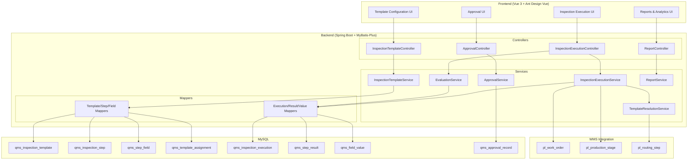
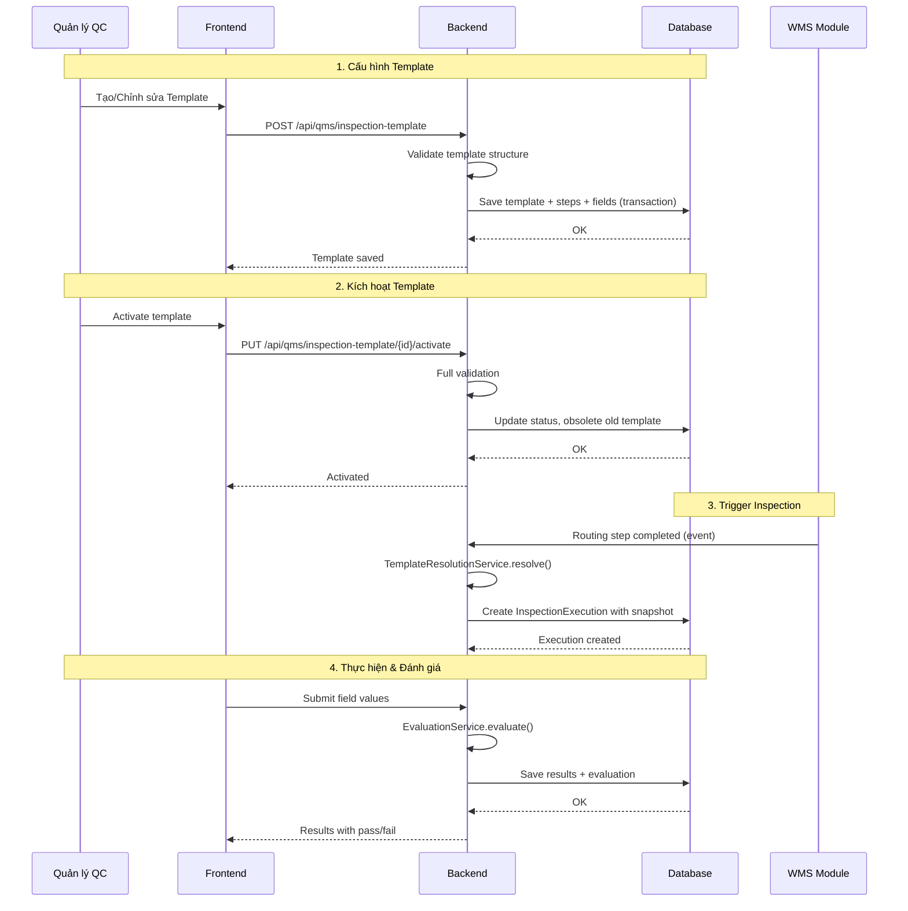
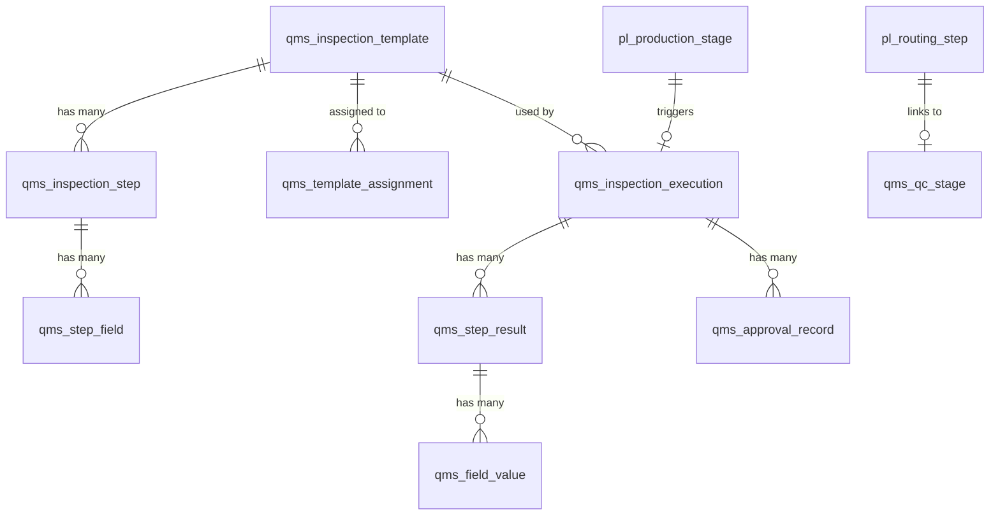
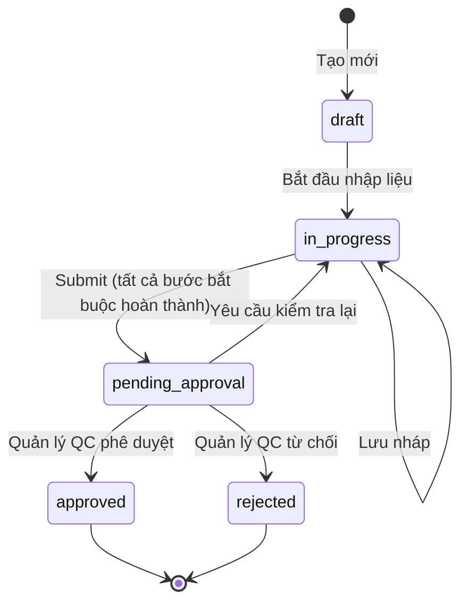

# Design Document: QMS Step Configuration

## Overview

Tính năng QMS Step Configuration nâng cấp module QMS hiện tại từ hệ thống checklist đơn giản thành hệ thống **Inspection Template** đầy đủ với khả năng:

- Định nghĩa template kiểm tra đa bước (multi-step) cho từng giai đoạn QC (IQC/PQC/FQC)
- Cấu hình trường dữ liệu động (5 field types: text, number, boolean, select, measurement)
- Đánh giá tự động kết quả pass/fail dựa trên dung sai và logic cấu hình
- Quy trình phê duyệt kết quả kiểm tra
- Tích hợp với routing steps của WMS Manufacturing Platform

### Quyết định thiết kế chính

1. **Mở rộng thay vì thay thế**: Giữ nguyên các bảng QMS hiện tại (`qms_checklist_template`, `qms_qc_stage`, etc.) và thêm bảng mới cho Inspection Template. Điều này đảm bảo backward compatibility.

2. **JSON cho cấu hình linh hoạt**: Sử dụng cột JSON (`field_config`) để lưu cấu hình đặc thù của từng field type (min/max, options, tolerance), thay vì tạo bảng riêng cho mỗi loại.

3. **Snapshot khi thực hiện**: Khi tạo Inspection Execution, snapshot toàn bộ cấu hình template tại thời điểm đó để đảm bảo kết quả kiểm tra không bị ảnh hưởng khi template thay đổi sau này.

4. **Multi-tenant qua sys_org_code**: Tuân theo pattern JeecgBoot hiện tại, sử dụng `sys_org_code` để phân tách dữ liệu giữa các công ty.

## Architecture

### Kiến trúc tổng quan



### Luồng xử lý chính



## Components and Interfaces

### Backend Components

#### 1. InspectionTemplateController
- **Trách nhiệm**: CRUD operations cho Inspection Template, bao gồm steps và fields
- **Base path**: `/api/qms/inspection-template`
- **Endpoints**:
  - `GET /list` - Danh sách template có phân trang và lọc
  - `GET /{id}` - Chi tiết template (bao gồm steps + fields)
  - `POST /` - Tạo template mới (kèm steps + fields)
  - `PUT /{id}` - Cập nhật template (kèm steps + fields)
  - `DELETE /{id}` - Xóa template (kiểm tra referential integrity)
  - `PUT /{id}/activate` - Kích hoạt template
  - `POST /{id}/clone` - Nhân bản template
  - `GET /{id}/preview` - Lấy dữ liệu preview

#### 2. TemplateAssignmentController
- **Trách nhiệm**: Quản lý gán template cho sản phẩm/nhóm sản phẩm
- **Base path**: `/api/qms/template-assignment`
- **Endpoints**:
  - `GET /list` - Danh sách assignments theo template
  - `POST /` - Gán template cho sản phẩm
  - `DELETE /{id}` - Gỡ assignment
  - `GET /resolve` - Tìm template phù hợp cho sản phẩm + stage type

#### 3. InspectionExecutionController
- **Trách nhiệm**: Quản lý phiên kiểm tra
- **Base path**: `/api/qms/inspection-execution`
- **Endpoints**:
  - `GET /list` - Danh sách phiên kiểm tra
  - `GET /{id}` - Chi tiết phiên kiểm tra (kèm results)
  - `POST /` - Tạo phiên kiểm tra mới
  - `PUT /{id}/save-draft` - Lưu nháp
  - `PUT /{id}/submit` - Submit để đánh giá
  - `PUT /{id}/step/{stepId}/values` - Lưu giá trị cho một bước

#### 4. EvaluationService
- **Trách nhiệm**: Logic đánh giá pass/fail
- **Methods**:
  - `evaluateField(FieldValue, StepField)` → FieldResult (PASS/FAIL)
  - `evaluateStep(StepResult)` → StepResult (PASS/FAIL)
  - `evaluateExecution(InspectionExecution)` → OverallResult (PASS/FAIL)

#### 5. TemplateResolutionService
- **Trách nhiệm**: Tìm template phù hợp theo thứ tự ưu tiên
- **Logic ưu tiên**:
  1. Template gán trực tiếp cho sản phẩm cụ thể + stage type
  2. Template gán cho nhóm sản phẩm + stage type
  3. Template mặc định cho stage type
- **Methods**:
  - `resolveTemplate(productId, stageType)` → InspectionTemplate

#### 6. ApprovalService
- **Trách nhiệm**: Quản lý quy trình phê duyệt
- **Base path**: `/api/qms/approval`
- **Endpoints**:
  - `GET /pending` - Danh sách chờ phê duyệt
  - `PUT /{executionId}/approve` - Phê duyệt
  - `PUT /{executionId}/reject` - Từ chối (kèm lý do)
  - `PUT /{executionId}/re-inspect` - Yêu cầu kiểm tra lại

#### 7. TemplateValidationService
- **Trách nhiệm**: Validate toàn bộ cấu hình template trước khi kích hoạt
- **Rules**:
  - Template phải có ≥ 1 step
  - Mỗi mandatory step phải có ≥ 1 field
  - Number field: min_value ≤ max_value
  - Measurement field: lower_tolerance < nominal_value < upper_tolerance
  - Select field: options JSON hợp lệ, ≥ 1 mục
- **Methods**:
  - `validateForActivation(template)` → List<ValidationError>

### Frontend Components

#### 1. InspectionTemplateList.vue
- Bảng danh sách template với filter (stage type, status, search)
- Actions: Tạo mới, Sửa, Xóa, Clone, Activate

#### 2. InspectionTemplateForm.vue
- Form chính để cấu hình template
- Nested components cho steps và fields
- Drag-and-drop reordering

#### 3. StepConfigPanel.vue
- Panel cấu hình cho mỗi Inspection Step
- Drag-and-drop sắp xếp steps
- Expandable/collapsible step cards

#### 4. FieldConfigForm.vue
- Form cấu hình cho mỗi Step Field
- Dynamic rendering dựa trên field_type:
  - `NumberFieldConfig`: min, max, decimal_places
  - `MeasurementFieldConfig`: nominal, upper, lower, unit
  - `SelectFieldConfig`: options list management
  - `BooleanFieldConfig`: custom labels
  - `TextFieldConfig`: placeholder, max_length

#### 5. InspectionExecutionForm.vue
- Form thực hiện kiểm tra theo template
- Step-by-step wizard navigation
- Dynamic field rendering based on field_type

#### 6. TemplatePreviewModal.vue
- Modal xem trước template dưới dạng form kiểm tra
- Cho phép nhập dữ liệu thử và xem kết quả đánh giá

### Dynamic Form Rendering Strategy

Frontend sử dụng component factory pattern để render đúng input cho mỗi field type:

```typescript
// fieldRenderers.ts
const FIELD_RENDERERS: Record<FieldType, Component> = {
  text: TextFieldInput,       // a-input hoặc a-textarea
  number: NumberFieldInput,   // a-input-number với min/max/precision
  boolean: BooleanFieldInput, // a-switch với custom labels
  select: SelectFieldInput,   // a-select với options từ config
  measurement: MeasurementFieldInput, // a-input-number + tolerance display
};
```

Mỗi renderer nhận props:
- `fieldConfig`: Cấu hình field (từ `field_config` JSON)
- `value`: Giá trị hiện tại
- `disabled`: Trạng thái readonly
- `showEvaluation`: Hiển thị kết quả đánh giá (pass/fail indicator)

### API Design

#### Template CRUD

```
# Tạo template mới (kèm steps + fields)
POST /api/qms/inspection-template
Content-Type: application/json
{
  "templateName": "Kiểm tra ngoại quan PCB",
  "description": "Template kiểm tra ngoại quan cho bo mạch PCB",
  "stageType": "pqc",
  "version": "1.0",
  "notes": "",
  "steps": [
    {
      "stepName": "Kiểm tra bề mặt",
      "description": "Kiểm tra bề mặt bo mạch",
      "sortOrder": 1,
      "isMandatory": true,
      "requiresApproval": false,
      "fields": [
        {
          "fieldName": "Độ phẳng bề mặt",
          "fieldCode": "surface_flatness",
          "fieldType": "measurement",
          "unit": "mm",
          "isRequired": true,
          "sortOrder": 1,
          "fieldConfig": {
            "nominalValue": 0.5,
            "upperTolerance": 0.8,
            "lowerTolerance": 0.2
          }
        },
        {
          "fieldName": "Tình trạng mối hàn",
          "fieldCode": "solder_condition",
          "fieldType": "boolean",
          "isRequired": true,
          "sortOrder": 2,
          "fieldConfig": {
            "trueLabel": "Đạt",
            "falseLabel": "Không đạt"
          }
        }
      ]
    }
  ]
}
```

```
# Response
{
  "success": true,
  "result": {
    "id": "uuid-xxx",
    "templateCode": "TPL20260315001",
    "templateName": "Kiểm tra ngoại quan PCB",
    "stageType": "pqc",
    "status": "draft",
    "version": "1.0",
    "stepCount": 1,
    "steps": [...]
  }
}
```

#### Kích hoạt Template

```
PUT /api/qms/inspection-template/{id}/activate

# Success Response
{ "success": true, "message": "Template activated successfully" }

# Validation Error Response (HTTP 422)
{
  "success": false,
  "message": "Validation failed",
  "result": {
    "errors": [
      { "path": "steps[0].fields", "message": "Step 'Kiểm tra bề mặt' phải có ít nhất một trường" },
      { "path": "steps[1].fields[0].fieldConfig", "message": "Giới hạn dưới phải nhỏ hơn giá trị danh nghĩa" }
    ]
  }
}
```

#### Tạo Inspection Execution

```
POST /api/qms/inspection-execution
{
  "productId": "product-uuid",
  "stageType": "pqc",
  "workOrderId": "wo-uuid",        // optional
  "productionStageId": "stage-uuid" // optional - link to routing step
}

# Response: Execution created with template snapshot
{
  "success": true,
  "result": {
    "id": "exec-uuid",
    "executionCode": "EXC20260315001",
    "templateId": "tpl-uuid",
    "templateName": "Kiểm tra ngoại quan PCB",
    "status": "draft",
    "steps": [
      {
        "stepId": "step-uuid",
        "stepName": "Kiểm tra bề mặt",
        "sortOrder": 1,
        "isMandatory": true,
        "status": "pending",
        "fields": [...]
      }
    ]
  }
}
```

#### Submit Field Values & Evaluate

```
PUT /api/qms/inspection-execution/{id}/step/{stepId}/values
{
  "values": [
    { "fieldId": "field-uuid-1", "value": "0.6" },
    { "fieldId": "field-uuid-2", "value": "true" }
  ]
}

# Response includes evaluation results
{
  "success": true,
  "result": {
    "stepResult": "pass",
    "fieldResults": [
      { "fieldId": "field-uuid-1", "value": "0.6", "result": "pass", "message": "Trong dung sai [0.2, 0.8]" },
      { "fieldId": "field-uuid-2", "value": "true", "result": "pass" }
    ]
  }
}
```

#### Approval Workflow

```
# Phê duyệt
PUT /api/qms/approval/{executionId}/approve
{ "comment": "Kết quả kiểm tra hợp lệ" }

# Từ chối
PUT /api/qms/approval/{executionId}/reject
{ "reason": "Giá trị đo không chính xác, cần kiểm tra lại bước 2", "stepId": "step-uuid" }

# Yêu cầu kiểm tra lại
PUT /api/qms/approval/{executionId}/re-inspect
{ "stepId": "step-uuid", "reason": "Cần đo lại với thiết bị đã hiệu chuẩn" }
```

## Data Models

### Database Schema

#### 1. qms_inspection_template (Mẫu kiểm tra)

```sql
CREATE TABLE IF NOT EXISTS `qms_inspection_template` (
    `id`               VARCHAR(36)   NOT NULL COMMENT 'Khóa chính',
    `template_code`    VARCHAR(50)   NOT NULL COMMENT 'Mã template (TPLyyyyMMddNNN)',
    `template_name`    VARCHAR(200)  NOT NULL COMMENT 'Tên template',
    `description`      TEXT          NULL     COMMENT 'Mô tả',
    `stage_type`       VARCHAR(10)   NOT NULL COMMENT 'Loại giai đoạn: iqc, pqc, fqc',
    `version`          VARCHAR(20)   NOT NULL DEFAULT '1.0' COMMENT 'Phiên bản',
    `status`           VARCHAR(20)   NOT NULL DEFAULT 'draft' COMMENT 'Trạng thái: draft, active, obsolete',
    `notes`            TEXT          NULL     COMMENT 'Ghi chú',
    `create_by`        VARCHAR(50)   NULL,
    `create_time`      DATETIME      NULL,
    `update_by`        VARCHAR(50)   NULL,
    `update_time`      DATETIME      NULL,
    `sys_org_code`     VARCHAR(64)   NULL     COMMENT 'Mã tổ chức (multi-tenant)',
    PRIMARY KEY (`id`),
    UNIQUE KEY `uk_tpl_code` (`template_code`),
    KEY `idx_tpl_stage_status` (`stage_type`, `status`),
    KEY `idx_tpl_org` (`sys_org_code`)
) ENGINE=InnoDB DEFAULT CHARSET=utf8mb4 COMMENT='Mẫu kiểm tra chất lượng (Inspection Template)';
```

#### 2. qms_inspection_step (Bước kiểm tra)

```sql
CREATE TABLE IF NOT EXISTS `qms_inspection_step` (
    `id`                 VARCHAR(36)   NOT NULL COMMENT 'Khóa chính',
    `template_id`        VARCHAR(36)   NOT NULL COMMENT 'FK → qms_inspection_template',
    `step_name`          VARCHAR(200)  NOT NULL COMMENT 'Tên bước kiểm tra',
    `description`        TEXT          NULL     COMMENT 'Mô tả bước',
    `sort_order`         INT           NOT NULL COMMENT 'Thứ tự thực hiện',
    `is_mandatory`       TINYINT(1)    NOT NULL DEFAULT 1 COMMENT '1=bắt buộc, 0=tùy chọn',
    `requires_approval`  TINYINT(1)    NOT NULL DEFAULT 0 COMMENT '1=cần phê duyệt, 0=không',
    PRIMARY KEY (`id`),
    KEY `idx_step_template` (`template_id`),
    UNIQUE KEY `uk_step_order` (`template_id`, `sort_order`)
) ENGINE=InnoDB DEFAULT CHARSET=utf8mb4 COMMENT='Bước kiểm tra trong template';
```

#### 3. qms_step_field (Trường dữ liệu)

```sql
CREATE TABLE IF NOT EXISTS `qms_step_field` (
    `id`             VARCHAR(36)   NOT NULL COMMENT 'Khóa chính',
    `step_id`        VARCHAR(36)   NOT NULL COMMENT 'FK → qms_inspection_step',
    `field_name`     VARCHAR(200)  NOT NULL COMMENT 'Tên trường',
    `field_code`     VARCHAR(100)  NULL     COMMENT 'Mã trường (dùng cho API)',
    `field_type`     VARCHAR(20)   NOT NULL COMMENT 'Kiểu: text, number, boolean, select, measurement',
    `unit`           VARCHAR(50)   NULL     COMMENT 'Đơn vị đo',
    `default_value`  VARCHAR(500)  NULL     COMMENT 'Giá trị mặc định',
    `is_required`    TINYINT(1)    NOT NULL DEFAULT 1 COMMENT '1=bắt buộc',
    `sort_order`     INT           NOT NULL DEFAULT 0 COMMENT 'Thứ tự hiển thị',
    `field_config`   JSON          NULL     COMMENT 'Cấu hình theo field_type (JSON)',
    `hint`           VARCHAR(500)  NULL     COMMENT 'Ghi chú hướng dẫn nhập',
    PRIMARY KEY (`id`),
    KEY `idx_field_step` (`step_id`)
) ENGINE=InnoDB DEFAULT CHARSET=utf8mb4 COMMENT='Trường dữ liệu trong bước kiểm tra';
```

**field_config JSON schema theo field_type:**

```json
// field_type = "number"
{
  "minValue": 0,
  "maxValue": 100,
  "decimalPlaces": 2
}

// field_type = "measurement"
{
  "nominalValue": 5.0,
  "upperTolerance": 5.5,
  "lowerTolerance": 4.5
}

// field_type = "select"
{
  "options": ["Tốt", "Trung bình", "Kém"]
}

// field_type = "boolean"
{
  "trueLabel": "Đạt",
  "falseLabel": "Không đạt"
}

// field_type = "text"
{
  "maxLength": 500,
  "multiline": false
}
```

#### 4. qms_template_assignment (Gán template cho sản phẩm)

```sql
CREATE TABLE IF NOT EXISTS `qms_template_assignment` (
    `id`               VARCHAR(36)   NOT NULL COMMENT 'Khóa chính',
    `template_id`      VARCHAR(36)   NOT NULL COMMENT 'FK → qms_inspection_template',
    `assignment_type`  VARCHAR(20)   NOT NULL COMMENT 'Loại gán: product, product_group, default',
    `target_id`        VARCHAR(36)   NULL     COMMENT 'ID sản phẩm hoặc nhóm SP (NULL nếu default)',
    `is_active`        TINYINT(1)    NOT NULL DEFAULT 1 COMMENT '1=đang áp dụng',
    `create_by`        VARCHAR(50)   NULL,
    `create_time`      DATETIME      NULL,
    `sys_org_code`     VARCHAR(64)   NULL,
    PRIMARY KEY (`id`),
    KEY `idx_assign_template` (`template_id`),
    KEY `idx_assign_target` (`assignment_type`, `target_id`),
    UNIQUE KEY `uk_assign_active` (`template_id`, `assignment_type`, `target_id`)
) ENGINE=InnoDB DEFAULT CHARSET=utf8mb4 COMMENT='Gán template cho sản phẩm/nhóm SP';
```

#### 5. qms_inspection_execution (Phiên kiểm tra)

```sql
CREATE TABLE IF NOT EXISTS `qms_inspection_execution` (
    `id`                  VARCHAR(36)   NOT NULL COMMENT 'Khóa chính',
    `execution_code`      VARCHAR(50)   NOT NULL COMMENT 'Mã phiên (EXCyyyyMMddNNN)',
    `template_id`         VARCHAR(36)   NOT NULL COMMENT 'FK → qms_inspection_template',
    `template_snapshot`   JSON          NULL     COMMENT 'Snapshot cấu hình template tại thời điểm tạo',
    `product_id`          VARCHAR(36)   NOT NULL COMMENT 'FK → product',
    `stage_type`          VARCHAR(10)   NOT NULL COMMENT 'Loại giai đoạn: iqc, pqc, fqc',
    `work_order_id`       VARCHAR(36)   NULL     COMMENT 'FK → pl_work_order',
    `production_stage_id` VARCHAR(36)   NULL     COMMENT 'FK → pl_production_stage',
    `inspector`           VARCHAR(100)  NULL     COMMENT 'Người kiểm tra',
    `inspection_date`     DATE          NULL     COMMENT 'Ngày kiểm tra',
    `overall_result`      VARCHAR(20)   NULL     COMMENT 'Kết quả tổng: pass, fail',
    `status`              VARCHAR(30)   NOT NULL DEFAULT 'draft'
                          COMMENT 'Trạng thái: draft, in_progress, pending_approval, approved, rejected',
    `approved_by`         VARCHAR(100)  NULL     COMMENT 'Người phê duyệt',
    `approved_time`       DATETIME      NULL     COMMENT 'Thời gian phê duyệt',
    `notes`               TEXT          NULL,
    `create_by`           VARCHAR(50)   NULL,
    `create_time`         DATETIME      NULL,
    `update_by`           VARCHAR(50)   NULL,
    `update_time`         DATETIME      NULL,
    `sys_org_code`        VARCHAR(64)   NULL,
    PRIMARY KEY (`id`),
    UNIQUE KEY `uk_exec_code` (`execution_code`),
    KEY `idx_exec_template` (`template_id`),
    KEY `idx_exec_product` (`product_id`),
    KEY `idx_exec_wo` (`work_order_id`),
    KEY `idx_exec_status` (`status`)
) ENGINE=InnoDB DEFAULT CHARSET=utf8mb4 COMMENT='Phiên kiểm tra chất lượng';
```

#### 6. qms_step_result (Kết quả bước kiểm tra)

```sql
CREATE TABLE IF NOT EXISTS `qms_step_result` (
    `id`              VARCHAR(36)   NOT NULL COMMENT 'Khóa chính',
    `execution_id`    VARCHAR(36)   NOT NULL COMMENT 'FK → qms_inspection_execution',
    `step_id`         VARCHAR(36)   NOT NULL COMMENT 'FK → qms_inspection_step (snapshot)',
    `step_name`       VARCHAR(200)  NOT NULL COMMENT 'Tên bước (snapshot)',
    `sort_order`      INT           NOT NULL COMMENT 'Thứ tự (snapshot)',
    `is_mandatory`    TINYINT(1)    NOT NULL DEFAULT 1 COMMENT 'Bắt buộc (snapshot)',
    `result`          VARCHAR(20)   NULL     COMMENT 'Kết quả: pass, fail, pending',
    `status`          VARCHAR(20)   NOT NULL DEFAULT 'pending'
                      COMMENT 'Trạng thái: pending, completed, approved, rejected, re_inspect',
    `completed_time`  DATETIME      NULL     COMMENT 'Thời gian hoàn thành',
    `notes`           TEXT          NULL,
    PRIMARY KEY (`id`),
    KEY `idx_sr_execution` (`execution_id`),
    KEY `idx_sr_step` (`step_id`)
) ENGINE=InnoDB DEFAULT CHARSET=utf8mb4 COMMENT='Kết quả bước kiểm tra';
```

#### 7. qms_field_value (Giá trị trường dữ liệu)

```sql
CREATE TABLE IF NOT EXISTS `qms_field_value` (
    `id`             VARCHAR(36)    NOT NULL COMMENT 'Khóa chính',
    `step_result_id` VARCHAR(36)    NOT NULL COMMENT 'FK → qms_step_result',
    `field_id`       VARCHAR(36)    NOT NULL COMMENT 'FK → qms_step_field (snapshot)',
    `field_name`     VARCHAR(200)   NOT NULL COMMENT 'Tên trường (snapshot)',
    `field_type`     VARCHAR(20)    NOT NULL COMMENT 'Kiểu trường (snapshot)',
    `field_config`   JSON           NULL     COMMENT 'Cấu hình trường (snapshot)',
    `is_required`    TINYINT(1)     NOT NULL DEFAULT 1 COMMENT 'Bắt buộc (snapshot)',
    `actual_value`   VARCHAR(1000)  NULL     COMMENT 'Giá trị thực tế nhập',
    `result`         VARCHAR(20)    NULL     COMMENT 'Kết quả: pass, fail, na',
    `eval_message`   VARCHAR(500)   NULL     COMMENT 'Thông báo đánh giá (vd: "Trong dung sai [4.5, 5.5]")',
    PRIMARY KEY (`id`),
    KEY `idx_fv_step_result` (`step_result_id`),
    KEY `idx_fv_field` (`field_id`)
) ENGINE=InnoDB DEFAULT CHARSET=utf8mb4 COMMENT='Giá trị trường dữ liệu trong phiên kiểm tra';
```

#### 8. qms_approval_record (Lịch sử phê duyệt)

```sql
CREATE TABLE IF NOT EXISTS `qms_approval_record` (
    `id`             VARCHAR(36)   NOT NULL COMMENT 'Khóa chính',
    `execution_id`   VARCHAR(36)   NOT NULL COMMENT 'FK → qms_inspection_execution',
    `step_result_id` VARCHAR(36)   NULL     COMMENT 'FK → qms_step_result (nếu phê duyệt từng bước)',
    `action`         VARCHAR(20)   NOT NULL COMMENT 'Hành động: approve, reject, re_inspect',
    `approver`       VARCHAR(100)  NOT NULL COMMENT 'Người phê duyệt',
    `reason`         TEXT          NULL     COMMENT 'Lý do (bắt buộc khi reject/re_inspect)',
    `action_time`    DATETIME      NOT NULL COMMENT 'Thời gian thực hiện',
    PRIMARY KEY (`id`),
    KEY `idx_apr_execution` (`execution_id`),
    KEY `idx_apr_step` (`step_result_id`)
) ENGINE=InnoDB DEFAULT CHARSET=utf8mb4 COMMENT='Lịch sử phê duyệt kết quả kiểm tra';
```

#### 9. ALTER TABLE - Tích hợp với Routing Step

```sql
-- Thêm cột qc_stage_id vào pl_routing_step để liên kết với QC stage
ALTER TABLE `pl_routing_step`
    ADD COLUMN `qc_stage_id` VARCHAR(36) NULL COMMENT 'FK → qms_qc_stage (trigger QC khi hoàn thành bước này)',
    ADD COLUMN `qc_stage_type` VARCHAR(10) NULL COMMENT 'Loại QC: iqc, pqc, fqc';

-- Thêm cột qc_status vào pl_production_stage để track trạng thái QC
ALTER TABLE `pl_production_stage`
    ADD COLUMN `qc_execution_id` VARCHAR(36) NULL COMMENT 'FK → qms_inspection_execution',
    ADD COLUMN `qc_blocked` TINYINT(1) NOT NULL DEFAULT 0 COMMENT '1=đang chờ QC hoàn thành';
```

### Entity Relationship Diagram



### State Machine - Inspection Execution



## Correctness Properties

*A property is a characteristic or behavior that should hold true across all valid executions of a system — essentially, a formal statement about what the system should do. Properties serve as the bridge between human-readable specifications and machine-verifiable correctness guarantees.*

### Property 1: Template code generation produces unique codes in correct format

*For any* number of templates created within the same system, each generated template_code SHALL match the format `TPL\d{8}\d{3}` AND no two templates SHALL have the same template_code.

**Validates: Requirements 1.1, 1.2**

### Property 2: Template clone preserves structure

*For any* Inspection Template with N steps and M total fields, cloning that template SHALL produce a new template with exactly N steps and M fields, where each step and field has identical configuration data (name, type, config, sort_order) but different IDs.

**Validates: Requirements 1.7**

### Property 3: Filter results match criteria

*For any* filter combination (stage_type, status, search text) applied to the template list, all returned templates SHALL match every specified filter criterion.

**Validates: Requirements 1.4**

### Property 4: Activating a template obsoletes the previous active template

*For any* product and QC stage type combination, when a new template is activated, the previously active template for that same product and stage type SHALL transition to status "obsolete", ensuring at most one active template exists per product+stage combination.

**Validates: Requirements 1.5, 5.3**

### Property 5: Referential integrity prevents deletion of used templates

*For any* Inspection Template that has at least one associated Inspection Execution, attempting to delete that template SHALL be rejected, and the error response SHALL include the exact count of associated executions.

**Validates: Requirements 1.6**

### Property 6: Sort order invariant after reordering

*For any* sequence of add, remove, or reorder operations on Inspection Steps within a template, the resulting sort_order values SHALL be unique within the template AND form a contiguous sequence starting from 1.

**Validates: Requirements 2.2, 2.4**

### Property 7: Cascade delete removes all child fields

*For any* Inspection Step with N associated Step Fields, deleting that step SHALL also delete all N fields, leaving zero orphaned field records referencing the deleted step.

**Validates: Requirements 2.5**

### Property 8: Field type change clears incompatible configuration

*For any* Step Field, when its field_type is changed from type A to type B, the field_config SHALL contain only keys valid for type B, with no residual keys from type A's schema.

**Validates: Requirements 3.8**

### Property 9: Template activation validation reports all errors

*For any* Inspection Template with multiple validation issues (missing steps, missing fields in mandatory steps, invalid number ranges, invalid measurement tolerances, invalid select options), the validation response SHALL contain ALL errors rather than stopping at the first error found.

**Validates: Requirements 4.1, 4.4, 4.6**

### Property 10: Numeric range validation correctness

*For any* number field where min_value > max_value, OR any measurement field where lower_tolerance ≥ nominal_value OR nominal_value ≥ upper_tolerance, the validation SHALL reject the configuration. Conversely, for any valid configuration (min ≤ max, lower < nominal < upper), validation SHALL accept it.

**Validates: Requirements 4.2, 4.3**

### Property 11: Template resolution follows priority order

*For any* product that has a product-specific template, a product-group template, and a default template all active for the same stage type, resolving the template SHALL return the product-specific template. If no product-specific template exists, it SHALL return the product-group template. If neither exists, it SHALL return the default template.

**Validates: Requirements 5.4, 6.1**

### Property 12: Completion validation enforces mandatory requirements

*For any* Inspection Execution, submission SHALL be rejected if any mandatory Inspection Step has incomplete required fields. Conversely, submission SHALL be accepted if all mandatory steps have all required fields filled.

**Validates: Requirements 6.5, 6.7**

### Property 13: Field evaluation correctness

*For any* measurement field value V with configured tolerance [lower, upper], the evaluation SHALL return PASS if and only if lower ≤ V ≤ upper. *For any* number field value V with configured range [min, max], the evaluation SHALL return PASS if and only if min ≤ V ≤ max.

**Validates: Requirements 7.1, 7.2**

### Property 14: Hierarchical result aggregation

*For any* Inspection Step, the step result SHALL be PASS if and only if ALL required fields have result PASS. *For any* Inspection Execution, the overall result SHALL be PASS if and only if ALL mandatory steps have result PASS. Optional/non-required items SHALL NOT affect the parent result.

**Validates: Requirements 7.4, 7.5**

### Property 15: State machine transition validity

*For any* Inspection Execution, the only valid state transitions SHALL be: draft→in_progress, in_progress→in_progress (save draft), in_progress→pending_approval, pending_approval→approved, pending_approval→rejected, pending_approval→in_progress (re-inspect). Any other transition SHALL be rejected.

**Validates: Requirements 8.6**

### Property 16: Re-inspection isolation

*For any* Inspection Execution with multiple steps where one step is marked for re-inspection, only the re-inspection step SHALL be editable. All other steps that were previously approved SHALL remain locked and their data unchanged.

**Validates: Requirements 8.5**

### Property 17: Routing step blocking during inspection

*For any* production stage linked to a QC inspection that is not yet approved, attempting to advance to the next routing step SHALL be blocked. The block SHALL be released only when the inspection reaches "approved" status.

**Validates: Requirements 9.3**

### Property 18: Statistics calculation correctness

*For any* set of Inspection Execution results, the computed pass/fail ratio SHALL equal the count of PASS results divided by total results. The Pareto analysis SHALL correctly identify and rank the top 5 fields with highest fail rates in descending order.

**Validates: Requirements 11.3, 11.4**

## Error Handling

### Backend Error Handling Strategy

| Tình huống | HTTP Status | Error Code | Xử lý |
|---|---|---|---|
| Template không tồn tại | 404 | TEMPLATE_NOT_FOUND | Return error message |
| Xóa template đang sử dụng | 409 | TEMPLATE_IN_USE | Return count of executions |
| Validation thất bại khi activate | 422 | VALIDATION_FAILED | Return all errors list |
| Duplicate template code | 409 | DUPLICATE_CODE | Return existing code |
| Transaction rollback | 500 | SAVE_FAILED | Rollback + return error detail |
| Unauthorized approval | 403 | INSUFFICIENT_PERMISSION | Return required role |
| Invalid state transition | 422 | INVALID_STATE_TRANSITION | Return current + attempted state |
| Template resolution failed | 404 | NO_TEMPLATE_FOUND | Return product + stage info |
| Routing step blocked by QC | 409 | QC_INSPECTION_PENDING | Return execution ID + status |

### Frontend Error Handling

1. **Validation errors**: Hiển thị inline error messages bên cạnh trường lỗi, highlight trường đỏ
2. **Network errors**: Toast notification với retry button
3. **Conflict errors** (409): Modal xác nhận với thông tin chi tiết
4. **Permission errors** (403): Redirect hoặc disable actions không có quyền

### Transaction Management

- Template save (template + steps + fields): Single `@Transactional` annotation
- Execution submit + evaluate: Single transaction
- Approval + status update + notification: Single transaction
- Rollback strategy: Spring `@Transactional(rollbackFor = Exception.class)`

## Testing Strategy

### Unit Tests (Example-based)

Sử dụng **JUnit 5 + Mockito** cho backend, **Vitest** cho frontend.

**Backend unit tests:**
- Template CRUD operations (create, update, delete with constraints)
- Each field type configuration validation (5 types × valid/invalid cases)
- Template activation with various valid/invalid structures
- Approval workflow state transitions
- Template resolution with different assignment configurations
- Code generation format verification

**Frontend unit tests:**
- Dynamic form rendering cho mỗi field type
- Drag-and-drop reorder logic
- Field type change behavior (config clearing)
- Step wizard navigation logic
- Preview mode isolation

### Property-Based Tests

Sử dụng **jqwik** (Java property-based testing library) cho backend logic.

**Cấu hình:**
- Minimum 100 iterations per property test
- Custom generators cho: FieldConfig, InspectionTemplate, StepField, MeasurementValue
- Tag format: `@Tag("Feature: qms-step-configuration, Property N: description")`

**Properties to implement:**
1. EvaluationService: Field evaluation correctness (Property 13)
2. EvaluationService: Hierarchical result aggregation (Property 14)
3. TemplateValidationService: Numeric range validation (Property 10)
4. TemplateValidationService: All errors reported (Property 9)
5. TemplateResolutionService: Priority resolution (Property 11)
6. InspectionExecutionService: State machine validity (Property 15)
7. InspectionExecutionService: Completion validation (Property 12)
8. QmsCodeGenerator: Unique code generation (Property 1)
9. InspectionTemplateService: Sort order invariant (Property 6)
10. InspectionTemplateService: Clone preserves structure (Property 2)

### Integration Tests

Sử dụng **Spring Boot Test + Testcontainers (MySQL)**.

- Template save/load round-trip with transaction
- Routing step completion triggers inspection creation
- Approval workflow end-to-end
- Notification creation on submit/reject
- Multi-tenant data isolation (sys_org_code filtering)

### Frontend E2E Tests

Sử dụng **Cypress** hoặc **Playwright**.

- Template configuration flow (create → add steps → add fields → activate)
- Inspection execution flow (open → fill fields → submit)
- Approval flow (view → approve/reject)
- Preview mode functionality


## Error Handling

### Chiến lược xử lý lỗi tổng quan

Hệ thống sử dụng **JeecgBoot Result wrapper** (`Result<T>`) làm format response thống nhất cho tất cả API endpoints. Mọi lỗi đều được trả về dưới dạng structured response thay vì exception không kiểm soát.

### Error Response Format

```java
// JeecgBoot standard Result wrapper
public class Result<T> {
    private boolean success;    // true/false
    private String message;     // Thông báo lỗi cho user
    private Integer code;       // HTTP status code hoặc business code
    private T result;           // Dữ liệu chi tiết (validation errors, etc.)
    private long timestamp;     // Thời gian response
}
```

**Ví dụ response lỗi validation:**
```json
{
  "success": false,
  "message": "Validation failed: Template không hợp lệ để kích hoạt",
  "code": 422,
  "result": {
    "errors": [
      {
        "path": "steps[0].fields",
        "field": null,
        "message": "Bước 'Kiểm tra bề mặt' bắt buộc phải có ít nhất một trường dữ liệu"
      },
      {
        "path": "steps[1].fields[2].fieldConfig",
        "field": "nominalValue",
        "message": "Giới hạn dưới (5.5) phải nhỏ hơn giá trị danh nghĩa (5.0)"
      }
    ]
  },
  "timestamp": 1710500000000
}
```

### Bảng phân loại lỗi Validation

| Mã lỗi | Loại lỗi | Điều kiện | HTTP Status | Thông báo mẫu |
|---------|-----------|-----------|-------------|----------------|
| TPL_001 | Template trống | Template không có step nào | 422 | "Template phải có ít nhất một bước kiểm tra" |
| TPL_002 | Step trống | Mandatory step không có field | 422 | "Bước '{stepName}' bắt buộc phải có ít nhất một trường" |
| TPL_003 | Number range invalid | min_value > max_value | 422 | "Giá trị tối thiểu ({min}) phải ≤ giá trị tối đa ({max})" |
| TPL_004 | Measurement tolerance invalid | lower ≥ nominal hoặc nominal ≥ upper | 422 | "Dung sai không hợp lệ: lower ({lower}) < nominal ({nominal}) < upper ({upper})" |
| TPL_005 | Select options empty | Danh sách options rỗng hoặc JSON invalid | 422 | "Trường select phải có ít nhất một tùy chọn hợp lệ" |
| TPL_006 | Duplicate template code | Mã template đã tồn tại | 409 | "Mã template '{code}' đã tồn tại trong hệ thống" |
| TPL_007 | Template in use | Xóa template đã có execution | 409 | "Không thể xóa template đã được sử dụng ({count} phiên kiểm tra)" |
| TPL_008 | Template not found | ID không tồn tại | 404 | "Không tìm thấy template với ID: {id}" |
| TPL_009 | Invalid status transition | Chuyển trạng thái không hợp lệ | 400 | "Không thể chuyển từ trạng thái '{from}' sang '{to}'" |
| EXE_001 | No template found | Không tìm được template phù hợp | 404 | "Không tìm thấy template active cho sản phẩm '{product}' giai đoạn '{stage}'" |
| EXE_002 | Incomplete mandatory step | Submit khi chưa hoàn thành | 400 | "Bước '{stepName}' chưa hoàn thành: thiếu {count} trường bắt buộc" |
| EXE_003 | Invalid status for action | Thao tác không phù hợp trạng thái | 400 | "Không thể submit: phiên kiểm tra đang ở trạng thái '{status}'" |
| EXE_004 | Step not accessible | Chưa hoàn thành bước trước | 400 | "Phải hoàn thành bước '{prevStep}' trước khi chuyển sang bước này" |
| APR_001 | Not authorized | Không có quyền phê duyệt | 403 | "Bạn không có quyền phê duyệt kết quả kiểm tra" |
| APR_002 | Reject without reason | Từ chối không có lý do | 400 | "Phải nhập lý do khi từ chối kết quả kiểm tra" |
| APR_003 | Already processed | Phiên đã được xử lý | 409 | "Phiên kiểm tra đã được {action} bởi {approver}" |

### Transaction Safety

```java
// Pattern cho save template + steps + fields trong một transaction
@Service
public class InspectionTemplateServiceImpl implements InspectionTemplateService {

    @Transactional(rollbackFor = Exception.class)
    public Result<InspectionTemplateVO> saveTemplateWithSteps(InspectionTemplateDTO dto) {
        try {
            // 1. Validate input
            List<ValidationError> errors = validationService.validateTemplate(dto);
            if (!errors.isEmpty()) {
                return Result.error(422, "Validation failed", errors);
            }

            // 2. Save template
            InspectionTemplate template = saveTemplate(dto);

            // 3. Save steps (batch)
            List<InspectionStep> steps = saveSteps(template.getId(), dto.getSteps());

            // 4. Save fields for each step (batch)
            for (int i = 0; i < steps.size(); i++) {
                saveFields(steps.get(i).getId(), dto.getSteps().get(i).getFields());
            }

            // 5. Return success
            return Result.OK(convertToVO(template, steps));
        } catch (DuplicateKeyException e) {
            throw new JeecgBootException("Mã template đã tồn tại");
        }
        // Nếu bất kỳ exception nào xảy ra → @Transactional rollback toàn bộ
    }
}
```

**Nguyên tắc transaction:**
- Mọi thao tác write liên quan đến template + steps + fields PHẢI nằm trong cùng một `@Transactional`
- Sử dụng `rollbackFor = Exception.class` để rollback cả checked exceptions
- Khi activate template: cập nhật status template mới + obsolete template cũ trong cùng transaction
- Khi tạo execution: tạo execution + step_results + field_values trong cùng transaction
- Khi submit values + evaluate: lưu values + kết quả đánh giá trong cùng transaction

### Frontend Error Handling

```typescript
// Xử lý response lỗi từ backend
async function handleApiError(response: Result<any>) {
  if (!response.success) {
    if (response.code === 422 && response.result?.errors) {
      // Hiển thị tất cả validation errors
      response.result.errors.forEach((err: ValidationError) => {
        // Highlight field lỗi trên form
        formRef.value?.setFieldError(err.path, err.message);
      });
      message.error('Vui lòng kiểm tra và sửa các lỗi được đánh dấu');
    } else if (response.code === 409) {
      // Conflict - hiển thị modal xác nhận
      Modal.confirm({ title: 'Xung đột', content: response.message });
    } else {
      message.error(response.message || 'Có lỗi xảy ra');
    }
  }
}
```

### Xử lý lỗi đặc biệt

| Tình huống | Xử lý Backend | Xử lý Frontend |
|------------|---------------|-----------------|
| Concurrent edit (2 user sửa cùng template) | Optimistic locking via `update_time` check | Hiển thị thông báo "Template đã được cập nhật bởi người khác, vui lòng tải lại" |
| Network timeout khi save | Transaction rollback tự động | Retry button + hiển thị trạng thái "Đang lưu..." |
| JSON parse error (field_config) | Catch JsonProcessingException, trả lỗi 400 | Validate JSON trước khi gửi |
| Template snapshot quá lớn | Giới hạn template_snapshot ≤ 1MB, reject nếu vượt | Cảnh báo khi template có quá nhiều steps/fields |

## Testing Strategy

### Tổng quan

Chiến lược testing kết hợp **unit tests**, **property-based tests**, **integration tests**, và **frontend tests** để đảm bảo coverage toàn diện. Property-based tests đóng vai trò quan trọng trong việc verify các correctness properties đã định nghĩa.

### 1. Unit Tests (JUnit 5 + Mockito)

Unit tests tập trung vào logic nghiệp vụ cụ thể, edge cases, và error conditions:

| Component | Test Focus | Ví dụ |
|-----------|-----------|-------|
| `EvaluationService` | Logic đánh giá pass/fail cho từng field type | Measurement value = boundary (exactly at tolerance limit) |
| `TemplateValidationService` | Từng rule validation riêng lẻ | Number field với min = max (hợp lệ) |
| `TemplateResolutionService` | Priority logic khi có/không có template ở mỗi level | Product có group template nhưng không có product template |
| `TemplateCodeGenerator` | Format và uniqueness | Generate code khi counter reset (ngày mới) |
| `InspectionExecutionService` | State transitions | Submit khi có step optional chưa hoàn thành (cho phép) |
| `ApprovalService` | Approval workflow logic | Re-inspect chỉ reset step bị reject, giữ nguyên step đã approved |

**Số lượng ước tính**: ~80-100 unit tests

### 2. Property-Based Tests (jqwik)

Sử dụng thư viện **[jqwik](https://jqwik.net/)** cho Java property-based testing. Mỗi property test chạy tối thiểu **100 iterations** với dữ liệu random.

#### Cấu hình jqwik

```xml
<!-- pom.xml -->
<dependency>
    <groupId>net.jqwik</groupId>
    <artifactId>jqwik</artifactId>
    <version>1.8.2</version>
    <scope>test</scope>
</dependency>
```

#### Mapping Properties → Tests

| Property | Test Class | Generator Strategy |
|----------|-----------|-------------------|
| Property 1: Template code uniqueness | `TemplateCodePropertyTest` | Generate N random timestamps, verify all codes unique + match regex |
| Property 2: Clone preserves structure | `TemplateClonePropertyTest` | Generate random templates (1-10 steps, 1-5 fields/step, random field types + configs) |
| Property 3: Filter results match | `TemplateFilterPropertyTest` | Generate list of templates with random stage/status, apply random filter combos |
| Property 4: Activate obsoletes previous | `TemplateActivationPropertyTest` | Generate sequence of activate operations for same product+stage |
| Property 5: Referential integrity | `TemplateDeletionPropertyTest` | Generate templates with 0-N executions, verify delete behavior |
| Property 6: Sort order invariant | `StepReorderPropertyTest` | Generate random sequences of add/remove/reorder operations |
| Property 7: Cascade delete | `StepCascadeDeletePropertyTest` | Generate steps with 0-10 fields, delete step, verify zero orphans |
| Property 8: Field type change clears config | `FieldTypeChangePropertyTest` | Generate all field type transitions (5×4=20 combinations), verify config cleanup |
| Property 9: Validation reports all errors | `TemplateValidationPropertyTest` | Generate templates with 1-N intentional errors, verify all reported |
| Property 10: Numeric range validation | `NumericValidationPropertyTest` | Generate random min/max/nominal/tolerance values, verify accept/reject correctness |
| Property 11: Template resolution priority | `TemplateResolutionPropertyTest` | Generate random assignment configurations (product/group/default), verify priority |
| Property 12: Completion validation | `ExecutionCompletionPropertyTest` | Generate executions with random mandatory/optional steps, random field completion |

#### Ví dụ Property Test

```java
// Feature: qms-step-configuration, Property 10: Numeric range validation correctness
@Property(tries = 200)
@Tag("property-based")
void numericRangeValidation_acceptsValidRejectsInvalid(
    @ForAll @DoubleRange(min = -1000, max = 1000) double a,
    @ForAll @DoubleRange(min = -1000, max = 1000) double b
) {
    double min = Math.min(a, b);
    double max = Math.max(a, b);

    StepField validField = createNumberField(min, max);
    assertThat(validationService.validateFieldConfig(validField)).isEmpty();

    if (a != b) {
        StepField invalidField = createNumberField(max, min); // min > max
        assertThat(validationService.validateFieldConfig(invalidField)).isNotEmpty();
    }
}

// Feature: qms-step-configuration, Property 6: Sort order invariant after reordering
@Property(tries = 100)
@Tag("property-based")
void sortOrderInvariant_afterAnyReorderSequence(
    @ForAll("reorderOperations") List<ReorderOp> operations
) {
    List<InspectionStep> steps = createInitialSteps(5);

    for (ReorderOp op : operations) {
        steps = applyOperation(steps, op);
    }

    // Verify: sort_order values are unique and contiguous from 1
    List<Integer> orders = steps.stream()
        .map(InspectionStep::getSortOrder)
        .sorted()
        .collect(Collectors.toList());

    assertThat(orders).isEqualTo(
        IntStream.rangeClosed(1, steps.size()).boxed().collect(Collectors.toList())
    );
}

// Feature: qms-step-configuration, Property 2: Template clone preserves structure
@Property(tries = 100)
@Tag("property-based")
void clonePreservesStructure(
    @ForAll("randomTemplates") InspectionTemplate template
) {
    InspectionTemplate cloned = templateService.cloneTemplate(template.getId());

    // Different IDs
    assertThat(cloned.getId()).isNotEqualTo(template.getId());

    // Same structure
    assertThat(cloned.getSteps()).hasSameSizeAs(template.getSteps());
    for (int i = 0; i < template.getSteps().size(); i++) {
        InspectionStep origStep = template.getSteps().get(i);
        InspectionStep clonedStep = cloned.getSteps().get(i);

        assertThat(clonedStep.getId()).isNotEqualTo(origStep.getId());
        assertThat(clonedStep.getStepName()).isEqualTo(origStep.getStepName());
        assertThat(clonedStep.getFields()).hasSameSizeAs(origStep.getFields());
    }
}
```

#### Tag Format

Mỗi property test PHẢI có comment tag theo format:
```
// Feature: qms-step-configuration, Property {N}: {property_title}
```

### 3. Integration Tests (Spring Boot Test + Testcontainers)

Integration tests verify toàn bộ flow end-to-end với database thực (MySQL via Testcontainers):

| Test Scenario | Mô tả |
|--------------|--------|
| Template CRUD flow | Tạo → Sửa → Clone → Activate → Obsolete |
| Execution full flow | Tạo execution → Nhập values → Evaluate → Submit → Approve |
| Template resolution with assignments | Gán template ở nhiều level, verify resolution đúng priority |
| Concurrent activation | 2 request activate cùng lúc cho cùng product+stage |
| Routing step integration | Complete routing step → Auto-create execution → Block next step |
| Approval workflow | Submit → Reject → Re-inspect → Submit lại → Approve |
| Report queries | Verify thống kê pass/fail, Pareto calculation |

**Số lượng ước tính**: ~30-40 integration tests

### 4. Frontend Tests

#### Component Tests (Vitest + Vue Test Utils)

| Component | Test Focus |
|-----------|-----------|
| `FieldConfigForm.vue` | Render đúng config form theo field_type, clear config khi đổi type |
| `StepConfigPanel.vue` | Drag-and-drop reorder, add/remove steps |
| `InspectionExecutionForm.vue` | Step navigation, mandatory field validation |
| `TemplatePreviewModal.vue` | Preview render, evaluation logic hiển thị đúng |
| `EvaluationDisplay.vue` | Màu sắc pass/fail, hiển thị tolerance range |

#### E2E Tests (Playwright - optional)

| Flow | Mô tả |
|------|--------|
| Template creation | Tạo template đầy đủ steps + fields, activate |
| Inspection execution | Thực hiện kiểm tra từ đầu đến submit |
| Approval flow | Phê duyệt / từ chối / yêu cầu kiểm tra lại |

### 5. Tổ chức Test Files

```
service/
└── jeecg-module-qms/
    └── src/test/java/org/jeecg/modules/qms/
        ├── property/                          # Property-based tests (jqwik)
        │   ├── TemplateCodePropertyTest.java
        │   ├── TemplateClonePropertyTest.java
        │   ├── TemplateFilterPropertyTest.java
        │   ├── TemplateActivationPropertyTest.java
        │   ├── TemplateDeletionPropertyTest.java
        │   ├── StepReorderPropertyTest.java
        │   ├── StepCascadeDeletePropertyTest.java
        │   ├── FieldTypeChangePropertyTest.java
        │   ├── TemplateValidationPropertyTest.java
        │   ├── NumericValidationPropertyTest.java
        │   ├── TemplateResolutionPropertyTest.java
        │   └── ExecutionCompletionPropertyTest.java
        ├── unit/                              # Unit tests (JUnit 5)
        │   ├── EvaluationServiceTest.java
        │   ├── TemplateValidationServiceTest.java
        │   ├── TemplateResolutionServiceTest.java
        │   ├── TemplateCodeGeneratorTest.java
        │   └── ApprovalServiceTest.java
        └── integration/                       # Integration tests
            ├── TemplateIntegrationTest.java
            ├── ExecutionIntegrationTest.java
            ├── ApprovalIntegrationTest.java
            └── RoutingIntegrationTest.java

web/
└── src/
    └── views/qms/inspection/
        └── __tests__/                         # Frontend component tests
            ├── FieldConfigForm.spec.ts
            ├── StepConfigPanel.spec.ts
            ├── InspectionExecutionForm.spec.ts
            └── TemplatePreviewModal.spec.ts
```

### 6. Cấu hình chạy tests

```bash
# Chạy tất cả unit + property tests
mvn test -pl jeecg-module-qms

# Chỉ chạy property-based tests
mvn test -pl jeecg-module-qms -Dgroups="property-based"

# Chạy integration tests (cần Docker cho Testcontainers)
mvn verify -pl jeecg-module-qms -Pintegration-test

# Frontend tests
cd web && npx vitest --run src/views/qms/
```
