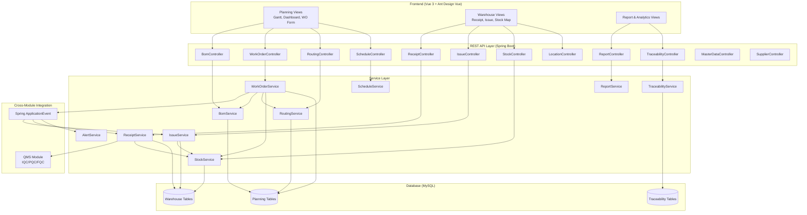
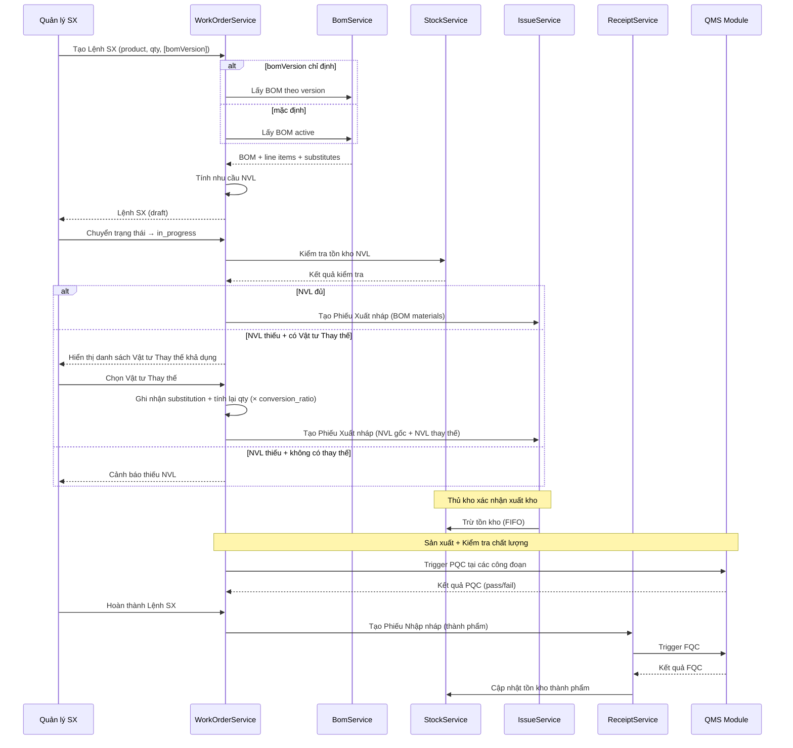
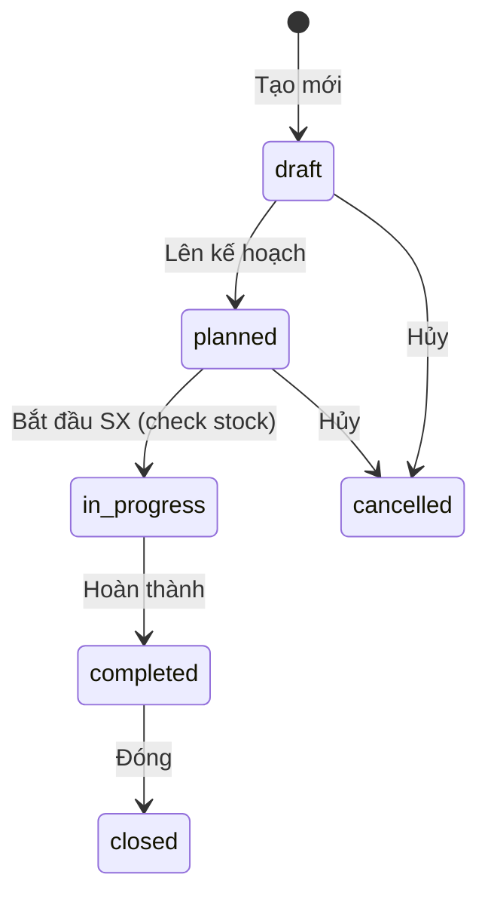
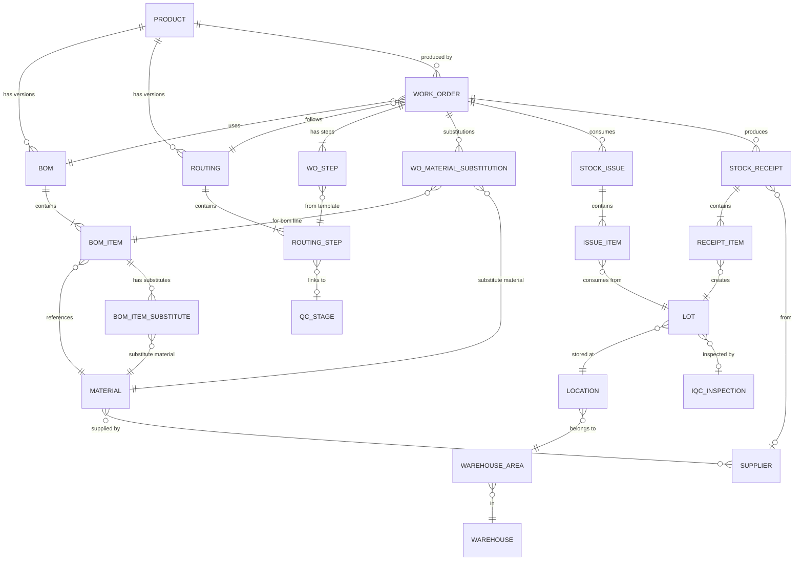

# Design Document: WMS Manufacturing Platform

## Overview

Nền tảng WMS Manufacturing Platform mở rộng hệ thống hiện có với ba module tích hợp chặt chẽ: **Lập kế hoạch sản xuất (Planning)**, **Quản lý kho (Warehouse)**, và **Quản lý chất lượng (QMS)**. Thiết kế này xây dựng trên nền tảng JeecgBoot hiện có, tận dụng các entity và pattern đã có (`WorkOrder`, `Routing`, `Inventory`, `StockTransaction`, `IqcInspection`...) và bổ sung các tính năng mới để hoàn thiện luồng sản xuất end-to-end.

### Quyết định thiết kế chính

1. **Tận dụng cấu trúc hiện có** — Các entity `WorkOrder`, `Routing`, `RoutingStep`, `Inventory`, `StockTransaction` đã tồn tại. Thiết kế này mở rộng chúng thay vì tạo mới.
2. **BOM tách riêng khỏi ItemMaster** — BOM là entity độc lập liên kết với product, hỗ trợ multi-version với chỉ một active tại một thời điểm.
3. **Event-driven cross-module** — Khi WO thay đổi trạng thái, các module khác được thông báo qua Spring Event (đồng bộ, trong cùng transaction khi cần consistency).
4. **FIFO enforcement** — Xuất kho áp dụng FIFO dựa trên `receipt_date` của Lot, đề xuất tự động nhưng cho phép Thủ kho override.
5. **Traceability qua Lot** — Mỗi giao dịch kho gắn với Lot, tạo chuỗi truy xuất: Lot thành phẩm → WO → Lot nguyên vật liệu → Nhà cung cấp.
6. **QMS integration qua service call** — Không dùng message queue (quá phức tạp cho SME), gọi trực tiếp QMS service trong cùng JVM.
7. **Vật tư thay thế (Material Substitution)** — Quan hệ many-to-many giữa BOM line items và substitute materials qua bảng trung gian `pl_bom_item_substitute`. Khi WO sử dụng vật tư thay thế, ghi nhận vào `pl_wo_material_substitution` để truy xuất nguồn gốc. Conversion ratio cho phép quy đổi số lượng khi đơn vị khác nhau.
8. **BOM version selection** — WO mặc định sử dụng BOM active, nhưng cho phép chọn phiên bản cụ thể (kể cả draft/obsolete) để hỗ trợ trường hợp sản xuất thử nghiệm hoặc sản xuất theo đơn hàng đặc biệt.

## Architecture



### Luồng dữ liệu chính



## Components and Interfaces

### 1. BOM Module

**Controller:** `BomController` — `/planning/bom/*`

| Endpoint | Method | Description |
|----------|--------|-------------|
| `/planning/bom/list` | GET | Danh sách BOM phân trang |
| `/planning/bom/add` | POST | Tạo BOM mới |
| `/planning/bom/edit` | PUT | Cập nhật BOM |
| `/planning/bom/delete` | DELETE | Xóa BOM (chỉ draft, không có WO tham chiếu) |
| `/planning/bom/queryById` | GET | Chi tiết BOM + line items |
| `/planning/bom/activate/{id}` | PUT | Kích hoạt BOM (obsolete BOM cũ) |
| `/planning/bom/calculateRequirements` | POST | Tính nhu cầu NVL theo số lượng SX |
| `/planning/bom/items/add` | POST | Thêm dòng NVL vào BOM |
| `/planning/bom/items/edit` | PUT | Sửa dòng NVL |
| `/planning/bom/items/delete` | DELETE | Xóa dòng NVL |
| `/planning/bom/items/substitutes/{bomItemId}` | GET | Danh sách vật tư thay thế của dòng BOM |
| `/planning/bom/items/substitutes/add` | POST | Thêm vật tư thay thế cho dòng BOM |
| `/planning/bom/items/substitutes/edit` | PUT | Sửa vật tư thay thế (ratio, priority) |
| `/planning/bom/items/substitutes/delete/{id}` | DELETE | Xóa vật tư thay thế |

**Service:** `BomService`
- `createBom(bom)` → tạo BOM ở trạng thái draft
- `activateBom(id)` → chuyển BOM sang active, obsolete BOM cũ cùng product
- `deleteBom(id)` → kiểm tra không có WO tham chiếu trước khi xóa
- `calculateRequirements(bomId, quantity)` → tính NVL = Σ(line_qty × quantity × (1 + wastage_rate))
- `getActiveBomByProduct(productId)` → trả về BOM active duy nhất
- `getBomByVersion(productId, version)` → trả về BOM theo phiên bản cụ thể
- `addSubstituteMaterial(bomItemId, substituteMaterialId, conversionRatio, priority)` → thêm vật tư thay thế, validate đơn vị tính hoặc conversion ratio hợp lệ
- `removeSubstituteMaterial(substituteId)` → xóa vật tư thay thế
- `getSubstitutesForBomItem(bomItemId)` → danh sách vật tư thay thế theo priority
- `validateSubstituteMaterial(bomItemId, substituteMaterialId, conversionRatio)` → kiểm tra cùng đơn vị hoặc ratio > 0

### 2. Work Order Module (Mở rộng entity hiện có)

**Controller:** `WorkOrderController` — `/planning/workOrder/*`

| Endpoint | Method | Description |
|----------|--------|-------------|
| `/planning/workOrder/list` | GET | Danh sách WO phân trang |
| `/planning/workOrder/add` | POST | Tạo WO (validate BOM + Routing active) |
| `/planning/workOrder/edit` | PUT | Cập nhật WO |
| `/planning/workOrder/delete` | DELETE | Xóa WO (chỉ draft) |
| `/planning/workOrder/transition/{id}` | PUT | Chuyển trạng thái |
| `/planning/workOrder/progress/{id}` | POST | Báo cáo tiến độ công đoạn |
| `/planning/workOrder/materialCheck/{id}` | GET | Kiểm tra tồn kho NVL |
| `/planning/workOrder/materialCheck/{id}/substitutes` | GET | Danh sách NVL thay thế khả dụng khi thiếu NVL chính |
| `/planning/workOrder/selectSubstitute` | POST | Chọn vật tư thay thế cho WO |
| `/planning/workOrder/substitutions/{id}` | GET | Danh sách vật tư thay thế đã chọn cho WO |
| `/planning/workOrder/dashboard` | GET | Dashboard tiến độ tổng hợp |
| `/planning/workOrder/overdue` | GET | Danh sách WO trễ hạn |

**Service:** `WorkOrderService`
- `createWorkOrder(wo)` → validate product có BOM active + Routing active, auto-link BOM (hoặc BOM version chỉ định), tính NVL
- `createWorkOrder(wo, bomVersion)` → tạo WO với phiên bản BOM cụ thể thay vì active mặc định
- `transition(id, targetStatus)` → state machine: draft→planned→in_progress→completed→closed
- `startProduction(id)` → kiểm tra tồn kho, publish `WorkOrderStartedEvent`
- `completeProduction(id, actualQty, passedQty, defectQty)` → publish `WorkOrderCompletedEvent`
- `reportProgress(id, stepId, completedQty, defectQty, duration)` → cập nhật % hoàn thành
- `calculateCompletion(id)` → actual_qty / planned_qty × 100
- `getOverdueOrders()` → WO có planned_end_date < now AND status ∈ {planned, in_progress}
- `checkMaterialWithSubstitutes(woId)` → kiểm tra tồn kho NVL, nếu thiếu thì trả về danh sách substitutes khả dụng kèm stock levels
- `selectSubstituteMaterial(woId, bomItemId, substituteMaterialId)` → ghi nhận vật tư thay thế, tính lại số lượng cần xuất = original_qty × conversion_ratio
- `getSubstitutions(woId)` → danh sách vật tư thay thế đã chọn cho WO

**State Machine:**


### 3. Scheduling Module

**Controller:** `ScheduleController` — `/planning/schedule/*`

| Endpoint | Method | Description |
|----------|--------|-------------|
| `/planning/schedule/gantt` | GET | Dữ liệu Gantt chart (WO theo timeline) |
| `/planning/schedule/calendar` | GET | Calendar view theo tuần/tháng |
| `/planning/schedule/reschedule/{id}` | PUT | Thay đổi lịch WO (drag-drop) |
| `/planning/schedule/conflicts` | GET | Kiểm tra xung đột nguồn lực |
| `/planning/schedule/capacity` | GET | Tỷ lệ sử dụng năng lực theo ngày |

**Service:** `ScheduleService`
- `getGanttData(startDate, endDate, filters)` → WO list với timeline data
- `reschedule(woId, newStart, newEnd)` → cập nhật lịch, kiểm tra conflict
- `detectConflicts(productionLineId, startDate, endDate, excludeWoId)` → tìm WO trùng lịch cùng dây chuyền
- `getCapacityUtilization(startDate, endDate)` → tính % sử dụng năng lực theo ngày
- `suggestAlternativeSlots(productionLineId, duration)` → đề xuất khung giờ trống

### 4. Routing Module (Mở rộng entity hiện có)

**Controller:** `RoutingController` — `/planning/routing/*`

| Endpoint | Method | Description |
|----------|--------|-------------|
| `/planning/routing/list` | GET | Danh sách routing |
| `/planning/routing/add` | POST | Tạo routing |
| `/planning/routing/edit` | PUT | Cập nhật routing |
| `/planning/routing/activate/{id}` | PUT | Kích hoạt routing |
| `/planning/routing/steps/{routingId}` | GET | Danh sách steps |
| `/planning/routing/steps/add` | POST | Thêm step |
| `/planning/routing/steps/reorder` | PUT | Sắp xếp lại thứ tự |

**Service:** `RoutingService`
- `activateRouting(id)` → kích hoạt routing, deactivate routing cũ cùng product
- `getActiveRoutingByProduct(productId)` → routing active duy nhất
- `instantiateForWorkOrder(woId, routingId)` → tạo WO step instances từ routing template

### 5. Receipt Module (Nhập kho)

**Controller:** `ReceiptController` — `/warehouse/receipt/*`

| Endpoint | Method | Description |
|----------|--------|-------------|
| `/warehouse/receipt/list` | GET | Danh sách phiếu nhập |
| `/warehouse/receipt/add` | POST | Tạo phiếu nhập |
| `/warehouse/receipt/edit` | PUT | Cập nhật phiếu nhập |
| `/warehouse/receipt/confirm/{id}` | PUT | Xác nhận nhập kho (cập nhật tồn) |
| `/warehouse/receipt/items/{id}` | GET | Chi tiết dòng nhập |
| `/warehouse/receipt/scanBarcode` | POST | Quét mã vạch tra cứu vật tư |

**Service:** `ReceiptService`
- `generateCode()` → `GRNyyyyMMddNNN`
- `createReceipt(receipt)` → tạo phiếu nhập draft
- `confirmReceipt(id)` → trong transaction: cập nhật tồn kho, tạo IQC nếu nhập từ NCC
- `createFromWorkOrder(woId, qty)` → tạo phiếu nhập thành phẩm từ WO hoàn thành
- `handleIqcResult(receiptId, result)` → unblock stock nếu IQC pass

### 6. Issue Module (Xuất kho)

**Controller:** `IssueController` — `/warehouse/issue/*`

| Endpoint | Method | Description |
|----------|--------|-------------|
| `/warehouse/issue/list` | GET | Danh sách phiếu xuất |
| `/warehouse/issue/add` | POST | Tạo phiếu xuất |
| `/warehouse/issue/edit` | PUT | Cập nhật phiếu xuất |
| `/warehouse/issue/confirm/{id}` | PUT | Xác nhận xuất kho (trừ tồn) |
| `/warehouse/issue/suggestFromBom/{woId}` | GET | Đề xuất NVL từ BOM |
| `/warehouse/issue/suggestLots/{materialId}` | GET | Đề xuất Lot theo FIFO |

**Service:** `IssueService`
- `generateCode()` → `GINyyyyMMddNNN`
- `createIssue(issue)` → tạo phiếu xuất draft
- `confirmIssue(id)` → trong transaction: kiểm tra tồn kho đủ, kiểm tra QC status, trừ tồn kho
- `suggestMaterialsFromBom(woId)` → lấy BOM items với số lượng cần xuất
- `suggestLotsFifo(materialId, requiredQty)` → đề xuất lots theo ngày nhập tăng dần
- `createFromWorkOrder(woId)` → tạo phiếu xuất NVL draft khi WO bắt đầu
- `validateQcStatus(lotId)` → kiểm tra lot không bị blocked/conditional_hold

### 7. Stock & Location Module

**Controller:** `StockController` — `/warehouse/stock/*`

| Endpoint | Method | Description |
|----------|--------|-------------|
| `/warehouse/stock/byMaterial/{id}` | GET | Tồn kho theo vật tư (tổng hợp) |
| `/warehouse/stock/byLocation/{id}` | GET | Tồn kho theo vị trí |
| `/warehouse/stock/byLot/{lotCode}` | GET | Tồn kho theo Lot |
| `/warehouse/stock/adjust` | POST | Điều chỉnh tồn kho (kiểm kê) |
| `/warehouse/stock/alerts` | GET | Danh sách cảnh báo tồn kho |
| `/warehouse/stock/kpi` | GET | KPI kho (utilization, turnover) |

**Controller:** `LocationController` — `/warehouse/location/*`

| Endpoint | Method | Description |
|----------|--------|-------------|
| `/warehouse/location/tree` | GET | Cây phân cấp kho |
| `/warehouse/location/map/{warehouseId}` | GET | Bản đồ 2D kho |
| `/warehouse/location/add` | POST | Thêm vị trí |
| `/warehouse/location/edit` | PUT | Sửa vị trí |

**Service:** `StockService`
- `getStockByMaterial(materialId)` → tổng hợp tồn kho từ tất cả vị trí
- `getStockByLocation(locationId)` → tất cả vật tư tại vị trí
- `getStockByLot(lotCode)` → chi tiết lot
- `increaseStock(locationId, materialId, lotCode, qty)` → tăng tồn kho (nhập)
- `decreaseStock(locationId, materialId, lotCode, qty)` → giảm tồn kho (xuất)
- `checkAvailability(materialId, requiredQty)` → kiểm tra tồn kho khả dụng (trừ blocked)
- `adjustStock(locationId, materialId, lotCode, newQty, reason)` → điều chỉnh kiểm kê
- `checkSafetyStock()` → kiểm tra tất cả vật tư, tạo alert nếu < min_level
- `calculateKpi(warehouseId)` → tính utilization, turnover, value

### 8. Traceability Module

**Controller:** `TraceabilityController` — `/traceability/*`

| Endpoint | Method | Description |
|----------|--------|-------------|
| `/traceability/forward/{lotCode}` | GET | Truy xuất xuôi (NVL → Thành phẩm) |
| `/traceability/backward/{lotCode}` | GET | Truy xuất ngược (Thành phẩm → NVL) |
| `/traceability/search` | GET | Tìm kiếm theo mã Lot/SP/WO/Phiếu |
| `/traceability/recall/{materialLotCode}` | GET | Xác định sản phẩm cần thu hồi |

**Service:** `TraceabilityService`
- `traceForward(lotCode)` → NVL lot → Issue → WO → Receipt → Thành phẩm lot
- `traceBackward(lotCode)` → Thành phẩm lot → Receipt → WO → Issue → NVL lots → Supplier
- `search(keyword)` → tìm theo lot code, product code, WO code, receipt/issue code
- `identifyAffectedProducts(materialLotCode)` → tìm tất cả thành phẩm sử dụng lot NVL này

### 9. Report Module

**Controller:** `ReportController` — `/report/*`

| Endpoint | Method | Description |
|----------|--------|-------------|
| `/report/production/output` | GET | Báo cáo sản lượng |
| `/report/production/kpi` | GET | KPI sản xuất (OEE, on-time, scrap) |
| `/report/production/trend` | GET | Biểu đồ xu hướng |
| `/report/inventory/summary` | GET | Báo cáo tồn kho |
| `/report/inventory/slowMoving` | GET | Hàng tồn lâu |
| `/report/inventory/expiring` | GET | Hàng sắp hết hạn |
| `/report/export` | GET | Xuất PDF/Excel |
| `/report/dashboard` | GET | Dashboard tổng hợp 3 module |

**Service:** `ReportService`
- `getProductionOutput(filters)` → sản lượng theo ngày/tuần/tháng/SP/dây chuyền
- `calculateOee(woId)` → OEE = availability × performance × quality
- `getOnTimeDeliveryRate(period)` → % WO hoàn thành đúng hạn
- `getScrapRate(period)` → % phế phẩm
- `getInventorySummary(filters)` → giá trị tồn, vòng quay, slow-moving
- `exportReport(format, reportType, filters)` → tạo file PDF/Excel

### 10. Cross-Module Integration (Spring Events)

```java
// Events published by WorkOrderService
public class WorkOrderStartedEvent {
    private String workOrderId;
    private String bomId;
    private BigDecimal quantity;
}

public class WorkOrderCompletedEvent {
    private String workOrderId;
    private BigDecimal actualQuantity;
    private BigDecimal passedQuantity;
}

// Event Listeners
@Component
public class WarehouseEventListener {
    @EventListener
    @Transactional
    public void onWorkOrderStarted(WorkOrderStartedEvent event) {
        // Tạo Phiếu Xuất nháp với NVL từ BOM
        issueService.createFromWorkOrder(event.getWorkOrderId());
    }

    @EventListener
    @Transactional
    public void onWorkOrderCompleted(WorkOrderCompletedEvent event) {
        // Tạo Phiếu Nhập nháp cho thành phẩm
        receiptService.createFromWorkOrder(
            event.getWorkOrderId(), event.getPassedQuantity());
    }
}

@Component
public class QmsEventListener {
    @EventListener
    public void onPqcFailed(PqcFailedEvent event) {
        // Cập nhật số lượng lỗi trên WO
        workOrderService.updateDefectCount(
            event.getWorkOrderId(), event.getDefectQuantity());
    }
}
```

### 11. Master Data & Supplier Module

**Controller:** `MasterDataController` — `/mdm/*`

| Endpoint | Method | Description |
|----------|--------|-------------|
| `/mdm/material/list` | GET | Danh mục vật tư |
| `/mdm/material/add` | POST | Thêm vật tư |
| `/mdm/material/edit` | PUT | Sửa vật tư |
| `/mdm/material/import` | POST | Import từ Excel |
| `/mdm/product/list` | GET | Danh mục sản phẩm |
| `/mdm/product/add` | POST | Thêm sản phẩm |
| `/mdm/product/import` | POST | Import từ Excel |

**Controller:** `SupplierController` — `/mdm/supplier/*`

| Endpoint | Method | Description |
|----------|--------|-------------|
| `/mdm/supplier/list` | GET | Danh mục nhà cung cấp |
| `/mdm/supplier/add` | POST | Thêm NCC |
| `/mdm/supplier/edit` | PUT | Sửa NCC |
| `/mdm/supplier/performance/{id}` | GET | Chỉ số đánh giá NCC |
| `/mdm/supplier/history/{id}` | GET | Lịch sử giao dịch |
| `/mdm/supplier/materials/{id}` | GET | Vật tư NCC cung cấp |

## Data Models

### Entity Relationship Diagram



### Bảng mới và mở rộng

#### `pl_bom` (BOM Header)
```sql
CREATE TABLE IF NOT EXISTS pl_bom (
    id              VARCHAR(36)   NOT NULL,
    bom_code        VARCHAR(50)   NOT NULL COMMENT 'Mã BOM (duy nhất)',
    bom_name        VARCHAR(200)  NOT NULL COMMENT 'Tên BOM',
    product_id      VARCHAR(36)   NOT NULL COMMENT 'FK → product',
    version         VARCHAR(20)   DEFAULT '1.0' COMMENT 'Phiên bản',
    status          VARCHAR(20)   DEFAULT 'draft' COMMENT 'draft/active/obsolete',
    effective_date  DATE          NULL COMMENT 'Ngày hiệu lực',
    notes           VARCHAR(500)  NULL,
    create_by       VARCHAR(50)   NULL,
    create_time     DATETIME      NULL,
    update_by       VARCHAR(50)   NULL,
    update_time     DATETIME      NULL,
    sys_org_code    VARCHAR(64)   NULL,
    PRIMARY KEY (id),
    UNIQUE KEY uk_bom_code (bom_code),
    KEY idx_product_status (product_id, status)
) ENGINE=InnoDB DEFAULT CHARSET=utf8mb4 COMMENT='BOM Header';
```

#### `pl_bom_item` (BOM Line Items)
```sql
CREATE TABLE IF NOT EXISTS pl_bom_item (
    id              VARCHAR(36)    NOT NULL,
    bom_id          VARCHAR(36)    NOT NULL COMMENT 'FK → pl_bom',
    material_id     VARCHAR(36)    NOT NULL COMMENT 'FK → material',
    material_code   VARCHAR(50)    NULL COMMENT 'Mã vật tư (denormalized)',
    material_name   VARCHAR(200)   NULL COMMENT 'Tên vật tư (denormalized)',
    quantity        DECIMAL(12,4)  NOT NULL COMMENT 'Số lượng định mức',
    unit            VARCHAR(20)    NOT NULL COMMENT 'Đơn vị tính',
    wastage_rate    DECIMAL(8,4)   DEFAULT 0 COMMENT 'Tỷ lệ hao hụt (0.05 = 5%)',
    item_type       VARCHAR(20)    DEFAULT 'raw_material' COMMENT 'raw_material/sub_assembly',
    child_bom_id    VARCHAR(36)    NULL COMMENT 'FK → pl_bom (nếu sub_assembly)',
    sort_order      INT            DEFAULT 0,
    notes           VARCHAR(500)   NULL,
    PRIMARY KEY (id),
    KEY idx_bom_id (bom_id),
    KEY idx_material (material_id)
) ENGINE=InnoDB DEFAULT CHARSET=utf8mb4 COMMENT='BOM Line Items';
```

#### `pl_bom_item_substitute` (Vật tư Thay thế cho dòng BOM)
```sql
CREATE TABLE IF NOT EXISTS pl_bom_item_substitute (
    id                  VARCHAR(36)    NOT NULL,
    bom_item_id         VARCHAR(36)    NOT NULL COMMENT 'FK → pl_bom_item',
    substitute_material_id VARCHAR(36) NOT NULL COMMENT 'FK → mdm_material (vật tư thay thế)',
    conversion_ratio    DECIMAL(10,6)  NOT NULL DEFAULT 1.000000 COMMENT 'Tỷ lệ quy đổi (qty thay thế = qty gốc × ratio)',
    priority            INT            NOT NULL DEFAULT 1 COMMENT 'Mức ưu tiên (1 = cao nhất)',
    notes               VARCHAR(500)   NULL,
    create_by           VARCHAR(50)    NULL,
    create_time         DATETIME       NULL,
    update_by           VARCHAR(50)    NULL,
    update_time         DATETIME       NULL,
    PRIMARY KEY (id),
    UNIQUE KEY uk_bom_item_substitute (bom_item_id, substitute_material_id),
    KEY idx_bom_item (bom_item_id),
    KEY idx_substitute_material (substitute_material_id),
    KEY idx_priority (bom_item_id, priority)
) ENGINE=InnoDB DEFAULT CHARSET=utf8mb4 COMMENT='Vật tư Thay thế cho dòng BOM (many-to-many)';
```

#### `pl_wo_material_substitution` (Ghi nhận Vật tư Thay thế đã chọn cho WO)
```sql
CREATE TABLE IF NOT EXISTS pl_wo_material_substitution (
    id                      VARCHAR(36)    NOT NULL,
    work_order_id           VARCHAR(36)    NOT NULL COMMENT 'FK → pl_work_order',
    bom_item_id             VARCHAR(36)    NOT NULL COMMENT 'FK → pl_bom_item (dòng NVL gốc)',
    original_material_id    VARCHAR(36)    NOT NULL COMMENT 'FK → mdm_material (NVL chính)',
    substitute_material_id  VARCHAR(36)    NOT NULL COMMENT 'FK → mdm_material (NVL thay thế đã chọn)',
    conversion_ratio        DECIMAL(10,6)  NOT NULL COMMENT 'Tỷ lệ quy đổi tại thời điểm chọn',
    original_quantity       DECIMAL(12,4)  NOT NULL COMMENT 'Số lượng NVL chính cần',
    substituted_quantity    DECIMAL(12,4)  NOT NULL COMMENT 'Số lượng NVL thay thế = original × ratio',
    reason                  VARCHAR(500)   NULL COMMENT 'Lý do thay thế',
    selected_by             VARCHAR(50)    NULL,
    selected_at             DATETIME       NULL,
    create_by               VARCHAR(50)    NULL,
    create_time             DATETIME       NULL,
    PRIMARY KEY (id),
    KEY idx_wo (work_order_id),
    KEY idx_bom_item (bom_item_id),
    KEY idx_substitute (substitute_material_id)
) ENGINE=InnoDB DEFAULT CHARSET=utf8mb4 COMMENT='Ghi nhận Vật tư Thay thế đã chọn cho Lệnh SX';
```

#### `pl_work_order` (Mở rộng entity hiện có)
```sql
-- Thêm cột vào bảng pl_work_order hiện có
ALTER TABLE pl_work_order
    ADD COLUMN routing_id VARCHAR(36) NULL COMMENT 'FK → pl_routing',
    ADD COLUMN planned_quantity DECIMAL(12,4) NULL COMMENT 'Số lượng kế hoạch',
    ADD COLUMN actual_quantity DECIMAL(12,4) NULL COMMENT 'Số lượng thực tế',
    ADD COLUMN passed_quantity DECIMAL(12,4) NULL COMMENT 'Số lượng đạt QC',
    ADD COLUMN defect_quantity DECIMAL(12,4) DEFAULT 0 COMMENT 'Số lượng lỗi',
    ADD COLUMN completion_pct DECIMAL(5,2) DEFAULT 0 COMMENT '% hoàn thành',
    ADD COLUMN is_overdue TINYINT(1) DEFAULT 0 COMMENT 'Trễ hạn',
    ADD COLUMN product_id VARCHAR(36) NULL COMMENT 'FK → product',
    ADD COLUMN selected_bom_version VARCHAR(20) NULL COMMENT 'Phiên bản BOM được chọn (null = active mặc định)';
```

#### `pl_wo_step` (Work Order Step Instances)
```sql
CREATE TABLE IF NOT EXISTS pl_wo_step (
    id                  VARCHAR(36)   NOT NULL,
    work_order_id       VARCHAR(36)   NOT NULL COMMENT 'FK → pl_work_order',
    routing_step_id     VARCHAR(36)   NOT NULL COMMENT 'FK → wh_routing_step',
    step_order          INT           NOT NULL,
    step_name           VARCHAR(200)  NOT NULL,
    status              VARCHAR(20)   DEFAULT 'pending' COMMENT 'pending/in_progress/completed/skipped',
    qc_required         TINYINT(1)    DEFAULT 0 COMMENT 'Yêu cầu QC trước khi chuyển bước',
    qc_stage_id         VARCHAR(36)   NULL COMMENT 'FK → qms_qc_stage',
    qc_passed           TINYINT(1)    NULL COMMENT 'Kết quả QC (null=chưa kiểm)',
    completed_qty       DECIMAL(12,4) DEFAULT 0,
    defect_qty          DECIMAL(12,4) DEFAULT 0,
    actual_start_time   DATETIME      NULL,
    actual_end_time     DATETIME      NULL,
    actual_duration_min INT           NULL COMMENT 'Thời gian thực tế (phút)',
    operator            VARCHAR(100)  NULL COMMENT 'Nhân viên thực hiện',
    notes               VARCHAR(500)  NULL,
    PRIMARY KEY (id),
    KEY idx_wo_id (work_order_id),
    KEY idx_step_order (work_order_id, step_order)
) ENGINE=InnoDB DEFAULT CHARSET=utf8mb4 COMMENT='Work Order Step Instances';
```

#### `wh_receipt` (Phiếu Nhập Kho)
```sql
CREATE TABLE IF NOT EXISTS wh_receipt (
    id                  VARCHAR(36)   NOT NULL,
    receipt_code        VARCHAR(50)   NOT NULL COMMENT 'GRNyyyyMMddNNN',
    receipt_type        VARCHAR(20)   NOT NULL COMMENT 'purchase/production/return/transfer',
    supplier_id         VARCHAR(36)   NULL COMMENT 'FK → supplier (nếu purchase)',
    work_order_id       VARCHAR(36)   NULL COMMENT 'FK → pl_work_order (nếu production)',
    receipt_date        DATE          NOT NULL,
    status              VARCHAR(20)   DEFAULT 'draft' COMMENT 'draft/confirmed/cancelled',
    confirmed_by        VARCHAR(50)   NULL,
    confirmed_at        DATETIME      NULL,
    notes               VARCHAR(500)  NULL,
    create_by           VARCHAR(50)   NULL,
    create_time         DATETIME      NULL,
    update_by           VARCHAR(50)   NULL,
    update_time         DATETIME      NULL,
    sys_org_code        VARCHAR(64)   NULL,
    PRIMARY KEY (id),
    UNIQUE KEY uk_receipt_code (receipt_code),
    KEY idx_type (receipt_type),
    KEY idx_wo (work_order_id),
    KEY idx_supplier (supplier_id)
) ENGINE=InnoDB DEFAULT CHARSET=utf8mb4 COMMENT='Phiếu Nhập Kho';
```

#### `wh_receipt_item` (Chi tiết Phiếu Nhập)
```sql
CREATE TABLE IF NOT EXISTS wh_receipt_item (
    id              VARCHAR(36)    NOT NULL,
    receipt_id      VARCHAR(36)    NOT NULL COMMENT 'FK → wh_receipt',
    material_id     VARCHAR(36)    NOT NULL COMMENT 'FK → material/product',
    quantity        DECIMAL(12,4)  NOT NULL,
    unit            VARCHAR(20)    NOT NULL,
    lot_code        VARCHAR(50)    NOT NULL COMMENT 'Mã Lot',
    production_date DATE           NULL COMMENT 'Ngày sản xuất',
    expiry_date     DATE           NULL COMMENT 'Hạn sử dụng',
    location_id     VARCHAR(36)    NOT NULL COMMENT 'FK → warehouse location',
    qc_status       VARCHAR(20)    DEFAULT 'pending' COMMENT 'pending/available/blocked/conditional_hold',
    notes           VARCHAR(500)   NULL,
    PRIMARY KEY (id),
    KEY idx_receipt (receipt_id),
    KEY idx_lot (lot_code),
    KEY idx_material (material_id)
) ENGINE=InnoDB DEFAULT CHARSET=utf8mb4 COMMENT='Chi tiết Phiếu Nhập Kho';
```

#### `wh_issue` (Phiếu Xuất Kho)
```sql
CREATE TABLE IF NOT EXISTS wh_issue (
    id              VARCHAR(36)   NOT NULL,
    issue_code      VARCHAR(50)   NOT NULL COMMENT 'GINyyyyMMddNNN',
    issue_type      VARCHAR(20)   NOT NULL COMMENT 'production/sales/return_supplier/transfer',
    work_order_id   VARCHAR(36)   NULL COMMENT 'FK → pl_work_order (nếu production)',
    issue_date      DATE          NOT NULL,
    status          VARCHAR(20)   DEFAULT 'draft' COMMENT 'draft/confirmed/cancelled',
    confirmed_by    VARCHAR(50)   NULL,
    confirmed_at    DATETIME      NULL,
    notes           VARCHAR(500)  NULL,
    create_by       VARCHAR(50)   NULL,
    create_time     DATETIME      NULL,
    update_by       VARCHAR(50)   NULL,
    update_time     DATETIME      NULL,
    sys_org_code    VARCHAR(64)   NULL,
    PRIMARY KEY (id),
    UNIQUE KEY uk_issue_code (issue_code),
    KEY idx_type (issue_type),
    KEY idx_wo (work_order_id)
) ENGINE=InnoDB DEFAULT CHARSET=utf8mb4 COMMENT='Phiếu Xuất Kho';
```

#### `wh_issue_item` (Chi tiết Phiếu Xuất)
```sql
CREATE TABLE IF NOT EXISTS wh_issue_item (
    id              VARCHAR(36)    NOT NULL,
    issue_id        VARCHAR(36)    NOT NULL COMMENT 'FK → wh_issue',
    material_id     VARCHAR(36)    NOT NULL COMMENT 'FK → material',
    quantity        DECIMAL(12,4)  NOT NULL,
    unit            VARCHAR(20)    NOT NULL,
    lot_code        VARCHAR(50)    NOT NULL COMMENT 'Mã Lot xuất',
    location_id     VARCHAR(36)    NOT NULL COMMENT 'FK → warehouse location (xuất từ)',
    notes           VARCHAR(500)   NULL,
    PRIMARY KEY (id),
    KEY idx_issue (issue_id),
    KEY idx_lot (lot_code),
    KEY idx_material (material_id)
) ENGINE=InnoDB DEFAULT CHARSET=utf8mb4 COMMENT='Chi tiết Phiếu Xuất Kho';
```

#### `wh_lot` (Quản lý Lot)
```sql
CREATE TABLE IF NOT EXISTS wh_lot (
    id              VARCHAR(36)    NOT NULL,
    lot_code        VARCHAR(50)    NOT NULL COMMENT 'Mã Lot (duy nhất)',
    material_id     VARCHAR(36)    NOT NULL COMMENT 'FK → material/product',
    lot_type        VARCHAR(20)    NOT NULL COMMENT 'raw_material/finished_goods',
    supplier_id     VARCHAR(36)    NULL COMMENT 'FK → supplier (nếu NVL)',
    work_order_id   VARCHAR(36)    NULL COMMENT 'FK → pl_work_order (nếu thành phẩm)',
    receipt_id      VARCHAR(36)    NULL COMMENT 'FK → wh_receipt',
    quantity        DECIMAL(12,4)  NOT NULL COMMENT 'Số lượng ban đầu',
    remaining_qty   DECIMAL(12,4)  NOT NULL COMMENT 'Số lượng còn lại',
    location_id     VARCHAR(36)    NULL COMMENT 'FK → warehouse location',
    production_date DATE           NULL,
    expiry_date     DATE           NULL,
    receipt_date    DATE           NOT NULL COMMENT 'Ngày nhập kho (dùng cho FIFO)',
    qc_status       VARCHAR(20)    DEFAULT 'pending' COMMENT 'pending/available/blocked/conditional_hold',
    status          VARCHAR(20)    DEFAULT 'active' COMMENT 'active/depleted/expired',
    create_by       VARCHAR(50)    NULL,
    create_time     DATETIME       NULL,
    update_by       VARCHAR(50)    NULL,
    update_time     DATETIME       NULL,
    PRIMARY KEY (id),
    UNIQUE KEY uk_lot_code (lot_code),
    KEY idx_material (material_id),
    KEY idx_location (location_id),
    KEY idx_receipt_date (material_id, receipt_date),
    KEY idx_qc_status (qc_status),
    KEY idx_wo (work_order_id)
) ENGINE=InnoDB DEFAULT CHARSET=utf8mb4 COMMENT='Quản lý Lot';
```

#### `wh_stock` (Tồn kho theo Vị trí + Vật tư)
```sql
CREATE TABLE IF NOT EXISTS wh_stock (
    id              VARCHAR(36)    NOT NULL,
    material_id     VARCHAR(36)    NOT NULL COMMENT 'FK → material/product',
    location_id     VARCHAR(36)    NOT NULL COMMENT 'FK → warehouse location',
    lot_code        VARCHAR(50)    NULL COMMENT 'Mã Lot (nullable cho tổng hợp)',
    quantity        DECIMAL(12,4)  NOT NULL DEFAULT 0,
    reserved_qty    DECIMAL(12,4)  DEFAULT 0 COMMENT 'Đã đặt trước cho WO',
    available_qty   DECIMAL(12,4)  GENERATED ALWAYS AS (quantity - reserved_qty) STORED,
    last_updated    DATETIME       NULL,
    PRIMARY KEY (id),
    UNIQUE KEY uk_stock (material_id, location_id, lot_code),
    KEY idx_material (material_id),
    KEY idx_location (location_id)
) ENGINE=InnoDB DEFAULT CHARSET=utf8mb4 COMMENT='Tồn kho theo Vị trí';
```

#### `wh_stock_adjustment` (Điều chỉnh Kiểm kê)
```sql
CREATE TABLE IF NOT EXISTS wh_stock_adjustment (
    id              VARCHAR(36)    NOT NULL,
    material_id     VARCHAR(36)    NOT NULL,
    location_id     VARCHAR(36)    NOT NULL,
    lot_code        VARCHAR(50)    NULL,
    old_quantity    DECIMAL(12,4)  NOT NULL,
    new_quantity    DECIMAL(12,4)  NOT NULL,
    difference      DECIMAL(12,4)  NOT NULL,
    reason          VARCHAR(500)   NOT NULL COMMENT 'Lý do điều chỉnh (bắt buộc)',
    adjusted_by     VARCHAR(50)    NOT NULL,
    adjusted_at     DATETIME       NOT NULL,
    PRIMARY KEY (id),
    KEY idx_material (material_id),
    KEY idx_date (adjusted_at)
) ENGINE=InnoDB DEFAULT CHARSET=utf8mb4 COMMENT='Lịch sử Điều chỉnh Kiểm kê';
```

#### `wh_warehouse` (Kho - cấp cao nhất)
```sql
CREATE TABLE IF NOT EXISTS wh_warehouse (
    id              VARCHAR(36)   NOT NULL,
    warehouse_code  VARCHAR(50)   NOT NULL,
    warehouse_name  VARCHAR(200)  NOT NULL,
    address         VARCHAR(500)  NULL,
    status          VARCHAR(20)   DEFAULT 'active',
    create_by       VARCHAR(50)   NULL,
    create_time     DATETIME      NULL,
    update_by       VARCHAR(50)   NULL,
    update_time     DATETIME      NULL,
    PRIMARY KEY (id),
    UNIQUE KEY uk_code (warehouse_code)
) ENGINE=InnoDB DEFAULT CHARSET=utf8mb4 COMMENT='Kho';
```

#### `wh_location` (Vị trí kho - phân cấp 4 level)
```sql
CREATE TABLE IF NOT EXISTS wh_location (
    id              VARCHAR(36)   NOT NULL,
    location_code   VARCHAR(50)   NOT NULL COMMENT 'Mã vị trí',
    location_name   VARCHAR(200)  NOT NULL,
    warehouse_id    VARCHAR(36)   NOT NULL COMMENT 'FK → wh_warehouse',
    parent_id       VARCHAR(36)   NULL COMMENT 'FK → wh_location (parent)',
    level           INT           NOT NULL COMMENT '1=Khu vực, 2=Kệ, 3=Ô',
    location_type   VARCHAR(20)   DEFAULT 'storage' COMMENT 'storage/staging/quarantine',
    capacity        INT           NULL COMMENT 'Sức chứa (đơn vị pallet/thùng)',
    status          VARCHAR(20)   DEFAULT 'available' COMMENT 'available/full/maintenance',
    pos_x           INT           NULL COMMENT 'Tọa độ X trên bản đồ 2D',
    pos_y           INT           NULL COMMENT 'Tọa độ Y trên bản đồ 2D',
    create_by       VARCHAR(50)   NULL,
    create_time     DATETIME      NULL,
    update_by       VARCHAR(50)   NULL,
    update_time     DATETIME      NULL,
    PRIMARY KEY (id),
    UNIQUE KEY uk_code (location_code),
    KEY idx_warehouse (warehouse_id),
    KEY idx_parent (parent_id)
) ENGINE=InnoDB DEFAULT CHARSET=utf8mb4 COMMENT='Vị trí Kho (phân cấp)';
```

#### `mdm_material` (Danh mục Vật tư)
```sql
CREATE TABLE IF NOT EXISTS mdm_material (
    id              VARCHAR(36)   NOT NULL,
    material_code   VARCHAR(50)   NOT NULL COMMENT 'Mã vật tư (duy nhất)',
    material_name   VARCHAR(200)  NOT NULL,
    category        VARCHAR(50)   NULL COMMENT 'Nhóm: raw_material/packaging/spare_part/auxiliary',
    unit            VARCHAR(20)   NOT NULL COMMENT 'Đơn vị tính',
    min_stock_level DECIMAL(12,4) NULL COMMENT 'Tồn kho tối thiểu (safety stock)',
    max_stock_level DECIMAL(12,4) NULL COMMENT 'Tồn kho tối đa',
    default_supplier_id VARCHAR(36) NULL COMMENT 'FK → supplier',
    status          VARCHAR(20)   DEFAULT 'active' COMMENT 'active/inactive',
    specifications  TEXT          NULL COMMENT 'Thông số kỹ thuật (JSON)',
    create_by       VARCHAR(50)   NULL,
    create_time     DATETIME      NULL,
    update_by       VARCHAR(50)   NULL,
    update_time     DATETIME      NULL,
    sys_org_code    VARCHAR(64)   NULL,
    PRIMARY KEY (id),
    UNIQUE KEY uk_material_code (material_code),
    KEY idx_category (category),
    KEY idx_status (status)
) ENGINE=InnoDB DEFAULT CHARSET=utf8mb4 COMMENT='Danh mục Vật tư';
```

#### `mdm_product` (Danh mục Sản phẩm)
```sql
CREATE TABLE IF NOT EXISTS mdm_product (
    id              VARCHAR(36)   NOT NULL,
    product_code    VARCHAR(50)   NOT NULL COMMENT 'Mã sản phẩm (duy nhất)',
    product_name    VARCHAR(200)  NOT NULL,
    category        VARCHAR(50)   NULL COMMENT 'Nhóm: finished_goods/semi_finished',
    unit            VARCHAR(20)   NOT NULL,
    packaging_spec  VARCHAR(200)  NULL COMMENT 'Quy cách đóng gói',
    status          VARCHAR(20)   DEFAULT 'active' COMMENT 'active/inactive',
    create_by       VARCHAR(50)   NULL,
    create_time     DATETIME      NULL,
    update_by       VARCHAR(50)   NULL,
    update_time     DATETIME      NULL,
    sys_org_code    VARCHAR(64)   NULL,
    PRIMARY KEY (id),
    UNIQUE KEY uk_product_code (product_code),
    KEY idx_category (category),
    KEY idx_status (status)
) ENGINE=InnoDB DEFAULT CHARSET=utf8mb4 COMMENT='Danh mục Sản phẩm';
```

#### `mdm_supplier` (Nhà cung cấp)
```sql
CREATE TABLE IF NOT EXISTS mdm_supplier (
    id              VARCHAR(36)   NOT NULL,
    supplier_code   VARCHAR(50)   NOT NULL COMMENT 'Mã NCC (duy nhất)',
    supplier_name   VARCHAR(200)  NOT NULL,
    address         VARCHAR(500)  NULL,
    contact_person  VARCHAR(100)  NULL,
    phone           VARCHAR(20)   NULL,
    email           VARCHAR(100)  NULL,
    status          VARCHAR(20)   DEFAULT 'active' COMMENT 'active/inactive/blacklisted',
    iqc_pass_rate   DECIMAL(5,2)  NULL COMMENT 'Tỷ lệ đạt IQC (%) - computed',
    avg_lead_time   INT           NULL COMMENT 'Thời gian giao hàng TB (ngày)',
    ncr_count       INT           DEFAULT 0 COMMENT 'Số NCR - computed',
    create_by       VARCHAR(50)   NULL,
    create_time     DATETIME      NULL,
    update_by       VARCHAR(50)   NULL,
    update_time     DATETIME      NULL,
    sys_org_code    VARCHAR(64)   NULL,
    PRIMARY KEY (id),
    UNIQUE KEY uk_supplier_code (supplier_code),
    KEY idx_status (status)
) ENGINE=InnoDB DEFAULT CHARSET=utf8mb4 COMMENT='Nhà cung cấp';
```

#### `mdm_supplier_material` (Liên kết NCC - Vật tư)
```sql
CREATE TABLE IF NOT EXISTS mdm_supplier_material (
    id              VARCHAR(36)   NOT NULL,
    supplier_id     VARCHAR(36)   NOT NULL,
    material_id     VARCHAR(36)   NOT NULL,
    is_preferred    TINYINT(1)    DEFAULT 0 COMMENT 'NCC ưu tiên',
    unit_price      DECIMAL(12,4) NULL,
    lead_time_days  INT           NULL,
    moq             DECIMAL(12,4) NULL COMMENT 'Minimum Order Quantity',
    notes           VARCHAR(500)  NULL,
    PRIMARY KEY (id),
    UNIQUE KEY uk_supplier_material (supplier_id, material_id),
    KEY idx_material (material_id)
) ENGINE=InnoDB DEFAULT CHARSET=utf8mb4 COMMENT='Liên kết NCC - Vật tư';
```

#### `wh_alert` (Cảnh báo)
```sql
CREATE TABLE IF NOT EXISTS wh_alert (
    id              VARCHAR(36)   NOT NULL,
    alert_type      VARCHAR(30)   NOT NULL COMMENT 'safety_stock/overdue_wo/supplier_quality/material_shortage',
    entity_type     VARCHAR(30)   NULL COMMENT 'material/work_order/supplier',
    entity_id       VARCHAR(36)   NULL,
    title           VARCHAR(200)  NOT NULL,
    message         TEXT          NULL,
    severity        VARCHAR(20)   DEFAULT 'warning' COMMENT 'info/warning/critical',
    target_roles    VARCHAR(200)  NULL COMMENT 'Vai trò nhận cảnh báo (comma-separated)',
    is_read         TINYINT(1)    DEFAULT 0,
    is_resolved     TINYINT(1)    DEFAULT 0,
    create_time     DATETIME      NOT NULL,
    resolved_time   DATETIME      NULL,
    PRIMARY KEY (id),
    KEY idx_type (alert_type),
    KEY idx_unread (is_read, create_time)
) ENGINE=InnoDB DEFAULT CHARSET=utf8mb4 COMMENT='Cảnh báo hệ thống';
```

## Correctness Properties

*A property is a characteristic or behavior that should hold true across all valid executions of a system — essentially, a formal statement about what the system should do. Properties serve as the bridge between human-readable specifications and machine-verifiable correctness guarantees.*

### Property 1: Document code generation format and uniqueness

*For any* document type (WO/GRN/GIN) and any date, all generated codes SHALL match the format `PREFIXyyyyMMddNNN` where NNN is a zero-padded sequential number, and no two codes of the same type generated on the same day SHALL be equal.

**Validates: Requirements 2.1, 6.1, 7.1**

### Property 2: BOM active uniqueness invariant

*For any* product at any point in time, there SHALL be at most one BOM with status `active`. Activating a new BOM for a product SHALL automatically set all other BOMs of that product to `obsolete`.

**Validates: Requirements 1.3, 1.4**

### Property 3: BOM deletion protection

*For any* BOM that is referenced by at least one Work Order, deletion SHALL be rejected regardless of the BOM's status.

**Validates: Requirements 1.5**

### Property 4: Material requirement calculation correctness

*For any* BOM with N line items and any production quantity Q, the calculated material requirement for each line item i SHALL equal `line_qty[i] × Q × (1 + wastage_rate[i])`, and the total requirement SHALL equal the sum of all individual requirements.

**Validates: Requirements 1.6, 2.3**

### Property 5: Work Order state machine validity

*For any* Work Order in a given state, only transitions defined in the state machine (draft→planned→in_progress→completed→closed, draft→cancelled, planned→cancelled) SHALL succeed; all other transition attempts SHALL be rejected without modifying the entity's state.

**Validates: Requirements 2.4**

### Property 6: Work Order creation requires active BOM and Routing

*For any* product, creating a Work Order SHALL succeed only if the product has both an active BOM AND an active Routing. If either is missing, creation SHALL be rejected with an error message identifying the missing component.

**Validates: Requirements 2.5**

### Property 7: Resource conflict detection

*For any* two Work Orders assigned to the same production line, if their date ranges [start, end] overlap, the system SHALL detect and report a resource conflict.

**Validates: Requirements 3.3**

### Property 8: Plan filtering correctness

*For any* combination of filter parameters (product, status, priority, date range), all returned Work Orders SHALL satisfy ALL applied filter conditions simultaneously.

**Validates: Requirements 3.5**

### Property 9: Completion percentage calculation

*For any* Work Order with planned quantity P > 0 and actual quantity A, the completion percentage SHALL equal `(A / P) × 100`, clamped to [0, 100].

**Validates: Requirements 4.2**

### Property 10: Overdue detection

*For any* Work Order where the current date exceeds the planned end date AND the status is in {planned, in_progress}, the Work Order SHALL be flagged as overdue.

**Validates: Requirements 4.4**

### Property 11: OEE calculation correctness

*For any* production data set with availability A (0-1), performance P (0-1), and quality Q (0-1), OEE SHALL equal `A × P × Q`, where availability = actual_run_time / planned_time, performance = actual_output / (theoretical_rate × actual_run_time), quality = good_qty / total_qty.

**Validates: Requirements 4.5**

### Property 12: Routing step instantiation

*For any* Routing with N ordered steps, when a Work Order starts production using that Routing, exactly N Work Order Step instances SHALL be created with step_order matching the routing template order.

**Validates: Requirements 5.3**

### Property 13: Step progression with QC gate

*For any* Work Order Step that has `qc_required = true`, the step SHALL NOT transition to `completed` status unless `qc_passed = true`. Steps without QC requirement SHALL transition freely.

**Validates: Requirements 5.4, 5.5**

### Property 14: Stock transaction correctness (receipt)

*For any* confirmed Receipt with line items, the stock quantity at each target location SHALL increase by exactly the receipt item quantity. The total stock increase across all locations SHALL equal the sum of all receipt line quantities.

**Validates: Requirements 6.3**

### Property 15: Stock transaction correctness (issue)

*For any* confirmed Issue with line items, the stock quantity at each source location SHALL decrease by exactly the issue item quantity. The total stock decrease SHALL equal the sum of all issue line quantities.

**Validates: Requirements 7.4**

### Property 16: BOM-based issue suggestion

*For any* Work Order with a linked BOM containing N line items, the suggested issue list SHALL contain exactly N materials with quantities equal to `bom_line_qty × wo_planned_qty × (1 + wastage_rate)`.

**Validates: Requirements 7.2**

### Property 17: FIFO lot ordering

*For any* material with multiple active lots, the suggested lots for issue SHALL be ordered by `receipt_date` ascending (earliest first). Lots with earlier receipt dates SHALL always appear before lots with later dates.

**Validates: Requirements 7.3**

### Property 18: Issue rejection when exceeding available stock

*For any* Issue confirmation where the requested quantity for a material at a location exceeds the available stock (quantity - reserved_qty), the confirmation SHALL be rejected.

**Validates: Requirements 7.5**

### Property 19: QC-blocked material cannot be issued

*For any* Lot with `qc_status` in {blocked, conditional_hold}, any attempt to include that Lot in an Issue confirmation SHALL be rejected.

**Validates: Requirements 7.6**

### Property 20: Multi-dimensional stock consistency

*For any* material, the sum of stock quantities across all locations SHALL equal the total stock for that material. Equivalently, `Σ(stock_by_location[material]) = total_stock[material]`.

**Validates: Requirements 8.2**

### Property 21: Safety stock alert generation

*For any* material where the total available stock falls below the configured `min_stock_level`, a safety stock alert SHALL exist (or be generated) for that material.

**Validates: Requirements 8.4**

### Property 22: Traceability chain integrity

*For any* finished goods Lot produced via a Work Order, the backward traceability query SHALL return: all raw material Lots consumed (via Issue linked to that WO), the supplier for each material Lot, and all QC results (IQC/PQC/FQC) associated with the production chain.

**Validates: Requirements 9.1, 9.2**

### Property 23: Reverse traceability completeness

*For any* raw material Lot that was consumed in one or more Work Orders (via Issues), the forward traceability query SHALL return ALL finished goods Lots produced by those Work Orders.

**Validates: Requirements 9.3, 9.5**

### Property 24: Material shortage early warning

*For any* planned Work Order where the total required material quantity (from BOM) exceeds the current available stock for at least one material, a shortage warning SHALL be generated.

**Validates: Requirements 10.5**

### Property 25: Master data code uniqueness

*For any* existing material code, product code, or supplier code in the system, attempting to create a new entity with the same code SHALL be rejected with a duplicate error.

**Validates: Requirements 12.4**

### Property 26: Inactive material filtering

*For any* material with status `inactive`, it SHALL NOT appear in selection lists for BOM line items, Receipt items, or Issue items.

**Validates: Requirements 12.6**

### Property 27: Authorization enforcement

*For any* API request from a user without the required permission for that endpoint, the system SHALL return HTTP 403 and the request SHALL NOT modify any data.

**Validates: Requirements 13.2, 13.4**

### Property 28: Audit log completeness

*For any* data modification operation (create, update, delete, state transition), an audit log entry SHALL be created containing: the operator identity, timestamp, action type, and the data before and after the change.

**Validates: Requirements 13.3**

### Property 29: Supplier performance metrics correctness

*For any* supplier with K IQC inspections in the last 3 months where P passed, the computed `iqc_pass_rate` SHALL equal `(P / K) × 100`. The `ncr_count` SHALL equal the number of NCR records linked to that supplier.

**Validates: Requirements 14.2**

### Property 30: Supplier quality alert threshold

*For any* supplier whose `iqc_pass_rate` computed over the last 3 months falls below 80%, a supplier quality alert SHALL be generated.

**Validates: Requirements 14.3**

### Property 31: Capacity utilization calculation

*For any* day with scheduled Work Orders on a production line, the capacity utilization SHALL equal `Σ(planned_hours_per_WO) / line_capacity_hours_per_day`. When utilization exceeds 100%, the day SHALL be flagged as over-capacity.

**Validates: Requirements 3.6, 3.7**

### Property 32: Substitute material many-to-many relationship integrity

*For any* substitute material linked to N BOM lines, querying substitutes from each of those BOM lines SHALL include that material. Conversely, for any BOM line with M substitutes, querying all BOM lines for each substitute SHALL include the original BOM line.

**Validates: Requirements 1.8**

### Property 33: Substitute material unit validation

*For any* BOM line item with unit U and any candidate substitute material with unit V, adding the substitute SHALL succeed only if U == V (same unit) OR a conversion ratio > 0 is provided. If U != V and conversion ratio is 0 or negative, the addition SHALL be rejected.

**Validates: Requirements 1.9**

### Property 34: BOM version selection for Work Order

*For any* product with multiple BOM versions, creating a Work Order without specifying a version SHALL link the active BOM. Creating a Work Order with an explicit version SHALL link that specific BOM version regardless of its status (draft/active/obsolete), provided the version exists.

**Validates: Requirements 2.2**

### Property 35: Substitute material availability display when primary insufficient

*For any* Work Order where a BOM line's primary material stock is less than the required quantity AND that BOM line has N substitutes defined, the material check SHALL return all N substitutes with their current available stock levels, ordered by priority ascending.

**Validates: Requirements 2.8**

### Property 36: Substitute material quantity recalculation

*For any* Work Order material substitution with original required quantity Q and conversion ratio R, the substituted quantity SHALL equal `Q × R`. The substitution record SHALL preserve the original material, substitute material, conversion ratio, and both quantities.

**Validates: Requirements 2.9**

## Error Handling

### Validation Errors

| Scenario | Response Message | HTTP Status |
|----------|-----------------|-------------|
| Chuyển trạng thái không hợp lệ | `"Không thể chuyển từ trạng thái {current} sang {target}"` | 400 |
| Tạo WO thiếu BOM active | `"Sản phẩm chưa có BOM ở trạng thái active"` | 400 |
| Tạo WO thiếu Routing active | `"Sản phẩm chưa có Routing ở trạng thái active"` | 400 |
| Xóa BOM đang được tham chiếu | `"Không thể xóa BOM đang được sử dụng bởi {N} lệnh sản xuất"` | 400 |
| Mã trùng lặp | `"Mã {entity} '{code}' đã tồn tại trong hệ thống"` | 400 |
| Xuất kho vượt tồn | `"Số lượng xuất ({requested}) vượt quá tồn kho khả dụng ({available})"` | 400 |
| Xuất NVL bị blocked | `"Lot {lotCode} đang bị chặn do QC chưa đạt, không thể xuất kho"` | 400 |
| Xuất thành phẩm chưa FQC | `"Thành phẩm chưa qua kiểm tra FQC, không thể xuất bán"` | 400 |
| Tồn kho không đủ để bắt đầu SX | `"Thiếu nguyên vật liệu: {list_of_shortages}"` | 400 |
| Vật tư thay thế không hợp lệ (đơn vị khác, thiếu ratio) | `"Vật tư thay thế phải có cùng đơn vị tính hoặc tỷ lệ quy đổi hợp lệ (> 0)"` | 400 |
| Vật tư thay thế trùng lặp | `"Vật tư '{code}' đã được định nghĩa là thay thế cho dòng BOM này"` | 400 |
| Phiên bản BOM không tồn tại | `"Không tìm thấy BOM phiên bản '{version}' cho sản phẩm này"` | 400 |
| Điều chỉnh kiểm kê thiếu lý do | `"Vui lòng nhập lý do điều chỉnh"` | 400 |
| Chuyển bước chưa qua QC | `"Công đoạn yêu cầu kiểm tra QC trước khi chuyển bước tiếp theo"` | 400 |
| Không có quyền | `"Bạn không có quyền thực hiện thao tác này"` | 403 |
| Entity không tìm thấy | `"Không tìm thấy {entity} với ID {id}"` | 404 |
| Xung đột nguồn lực | `"Xung đột lịch sản xuất trên dây chuyền {line} từ {date1} đến {date2}"` | 409 |

### Error Response Format

Tuân theo chuẩn JeecgBoot `Result` wrapper:
```json
{
  "success": false,
  "message": "Mô tả lỗi bằng tiếng Việt",
  "code": 400,
  "result": null
}
```

Với lỗi validation chi tiết (ví dụ: thiếu NVL):
```json
{
  "success": false,
  "message": "Thiếu nguyên vật liệu để bắt đầu sản xuất",
  "code": 400,
  "result": {
    "shortages": [
      {
        "materialCode": "NVL001",
        "materialName": "Thép tấm",
        "required": 100,
        "available": 60,
        "shortage": 40,
        "substitutes": [
          {"materialCode": "NVL001-A", "materialName": "Thép tấm loại B", "conversionRatio": 1.1, "priority": 1, "availableStock": 50},
          {"materialCode": "NVL001-B", "materialName": "Thép tấm loại C", "conversionRatio": 1.2, "priority": 2, "availableStock": 30}
        ]
      },
      {"materialCode": "NVL002", "materialName": "Bu lông M8", "required": 500, "available": 0, "shortage": 500, "substitutes": []}
    ]
  }
}
```

### Transaction Safety

- Tất cả thao tác cập nhật tồn kho (nhập/xuất/điều chỉnh) PHẢI nằm trong `@Transactional(rollbackFor = Exception.class)`
- Cross-module events (WO started → tạo phiếu xuất draft) sử dụng `@TransactionalEventListener(phase = AFTER_COMMIT)` để đảm bảo WO đã commit thành công trước khi tạo phiếu
- Alert/notification failures SHALL NOT rollback main operations (wrapped in try-catch)
- Concurrent stock updates sử dụng optimistic locking (`version` column) hoặc `SELECT ... FOR UPDATE` cho critical sections

### Concurrency Handling

- Code generation: `SELECT MAX(code) ... FOR UPDATE` + sequential increment (acceptable cho SME scale)
- Stock updates: Optimistic locking với `@Version` annotation trên `wh_stock.version`
- BOM activation: Pessimistic lock trên product_id để tránh race condition khi 2 user activate cùng lúc

## Testing Strategy

### Unit Tests (JUnit 5 + Mockito)

Focus on:
- State machine transition validation (WO, Receipt, Issue)
- Code generation format compliance
- BOM material requirement calculation
- Completion percentage computation
- OEE calculation logic
- FIFO lot ordering
- Stock availability checks
- Capacity utilization computation
- Supplier performance metric calculation
- Overdue detection logic
- QC gate enforcement logic
- Substitute material unit validation (same unit vs different unit with ratio)
- Substitute material quantity recalculation (original_qty × conversion_ratio)
- BOM version selection logic (default active vs explicit version)

### Property-Based Tests (jqwik)

Sử dụng **jqwik** (Java property-based testing library tương thích JUnit 5).

**Configuration:**
- Minimum 100 iterations per property test (`@Property(tries = 100)`)
- Each test tagged with feature and property reference

**Properties to implement:**
1. Code generation format and uniqueness (Property 1)
2. BOM active uniqueness invariant (Property 2)
3. BOM deletion protection (Property 3)
4. Material requirement calculation (Property 4)
5. Work Order state machine validity (Property 5)
6. WO creation requires BOM + Routing (Property 6)
7. Resource conflict detection (Property 7)
8. Plan filtering correctness (Property 8)
9. Completion percentage calculation (Property 9)
10. Overdue detection (Property 10)
11. OEE calculation (Property 11)
12. Routing step instantiation (Property 12)
13. Step progression with QC gate (Property 13)
14. Stock transaction correctness - receipt (Property 14)
15. Stock transaction correctness - issue (Property 15)
16. BOM-based issue suggestion (Property 16)
17. FIFO lot ordering (Property 17)
18. Issue rejection exceeding stock (Property 18)
19. QC-blocked material rejection (Property 19)
20. Multi-dimensional stock consistency (Property 20)
21. Safety stock alert (Property 21)
22. Traceability chain integrity (Property 22)
23. Reverse traceability (Property 23)
24. Material shortage warning (Property 24)
25. Master data code uniqueness (Property 25)
26. Inactive material filtering (Property 26)
27. Authorization enforcement (Property 27)
28. Audit log completeness (Property 28)
29. Supplier metrics correctness (Property 29)
30. Supplier quality alert (Property 30)
31. Capacity utilization (Property 31)
32. Substitute material many-to-many relationship integrity (Property 32)
33. Substitute material unit validation (Property 33)
34. BOM version selection for Work Order (Property 34)
35. Substitute material availability display (Property 35)
36. Substitute material quantity recalculation (Property 36)

**Tag format:** `Feature: wms-manufacturing-platform, Property {N}: {description}`

### Integration Tests

- WO lifecycle end-to-end: create → plan → start (check stock) → progress → complete
- WO creation with explicit BOM version selection
- Receipt confirmation → stock update → IQC trigger (supplier receipt)
- Issue confirmation → stock deduction → FIFO enforcement
- WO start → auto-create draft issue (event-driven)
- WO complete → auto-create draft receipt (event-driven)
- PQC failure → WO defect count update
- Traceability chain: create full chain and verify forward/backward queries
- Cross-module transaction rollback on failure
- Material substitution flow: primary stock insufficient → show substitutes → select substitute → recalculate qty → create issue with substitute material
- BOM substitute CRUD: add/edit/delete substitutes, verify many-to-many links

### Frontend Tests (Vitest)

- Gantt chart data rendering with mock API
- Form validation for BOM, WO, Receipt, Issue forms
- Permission-based UI element visibility
- Dashboard data display with mock responses
- Drag-drop schedule interaction
- Barcode scan input handling

### Performance Tests

- Report generation within 3 seconds for 10,000+ records
- Stock query performance with 100,000+ lot records
- Concurrent receipt/issue confirmation (optimistic locking)
